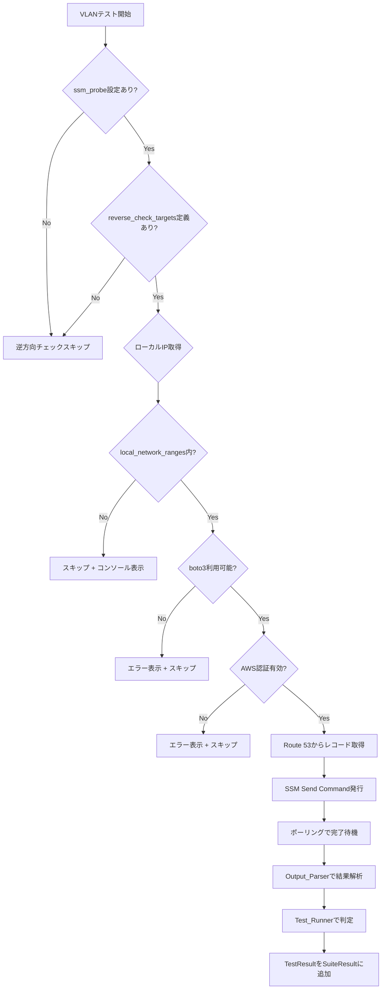
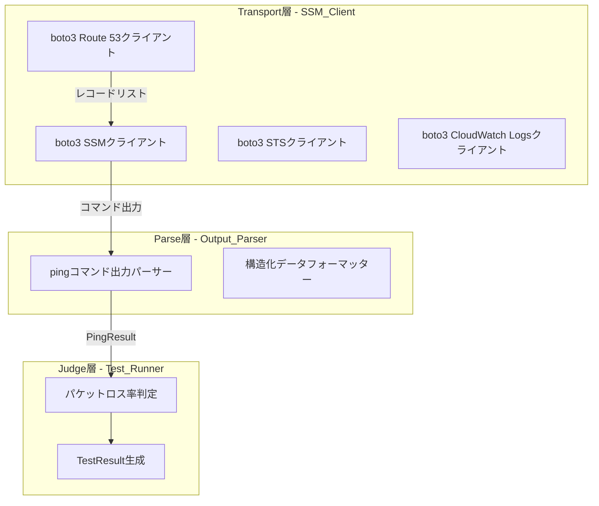
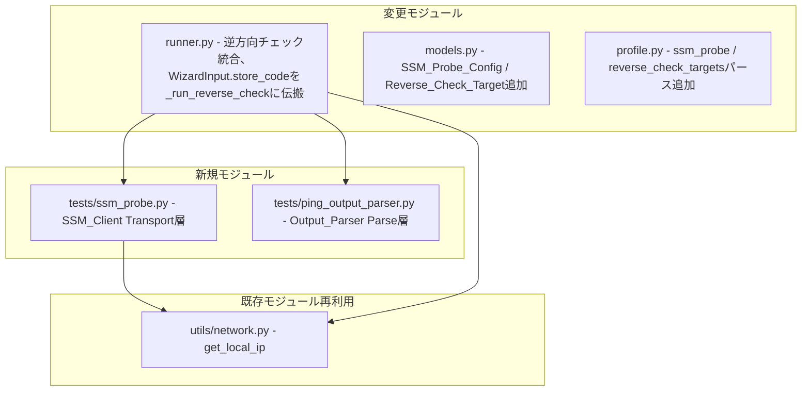
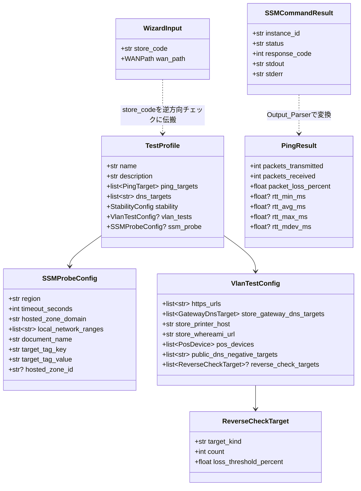

# 設計ドキュメント: SSMプローブ逆方向チェック

## Overview

本設計は、店舗ネットワークテスト自動化ツールに「AWS VPC → 店舗」方向の逆方向接続性チェック機能を追加する拡張である。

現行ツールは「ローカルPC → 外部」の片方向テストのみ対応しているが、本機能により AWS VPC 内の EC2 プローブインスタンスから店舗ネットワークへの ICMP ping を実行し、双方向のネットワーク接続性を検証可能にする。

### 設計方針

- **3層アーキテクチャ**: Transport層（SSM_Client）、Parse層（Output_Parser）、Judge層（Test_Runner）の責務分離
- **既存パターン準拠**: 既存テストモジュール（`dns.py`, `ping.py`）と同じ `TestResult` ベースのパターンに従う
- **後方互換性**: `ssm_probe` セクション省略時は逆方向チェック無効、既存テストに影響なし
- **VLAN定義側に `reverse_check_targets` を持たせる**: 各VLANテスト定義内にオプションフィールドとして逆方向チェック対象を定義
- **boto3前提**: AWS CLI サブプロセスではなく、boto3（AWS SDK for Python）を直接使用
- **プローブ共有**: 親spec `devops-agent-mcp-server` が管理するEC2プローブを共有利用（タグ `NetCheckProbe=true` で識別）
- **Route 53クエリはローカルPC側で実行**: プローブEC2にRoute 53アクセス権限を付与しない

### 2種類のチェック対象

1. **チェック端末（ローカルPC）へのICMP ping**: `get_local_ip()` で取得したIPアドレスをターゲットとする
2. **名前付き端末へのICMP ping**: Route 53から `*.s<store_code>.<hosted_zone_domain>` パターンで動的取得したレコードをターゲットとする

### 実行条件

- `ssm_probe` セクションがプロファイルに存在すること
- 当該VLANテスト定義に `reverse_check_targets` が存在すること
- ローカルPCのIPアドレスが `local_network_ranges` のいずれかの範囲内にあること（デフォルト: 192.168.2.0〜192.168.255.255）
- boto3がインポート可能かつAWS認証情報が有効であること

### 実行時間の目安

逆方向チェックを有効化すると、既存テストに加えて数分のオーバーヘッドが追加される。

- 単一ターゲット × 単一プローブ: 約15秒（ping count=5で5秒 + SSMオーバーヘッド8〜10秒）
- 実行時間 ≈ VLANテスト数 × ターゲット数 × 15秒（プローブは並列実行のため台数に比例しない）
- 例: 1VLAN × 平均5ターゲット（localpc + rt + enc1 + enc2 + prn）× 1プローブ = 約75秒
- 例: 1VLAN × 平均5ターゲット × 2プローブ = 約75秒（並列のため同じ）

運用者は逆方向チェック有効化時に1〜2分程度の追加実行時間を想定すること。

### 主要フロー



## Architecture

### 3層アーキテクチャ



### 新規・変更モジュール



### ディレクトリ構成（変更箇所）

```
src/store_net_test/
├── models.py              # SSM_Probe_Config, ReverseCheckTarget, PingResult追加
├── profile.py             # ssm_probe / reverse_check_targets パース・バリデーション追加
├── runner.py              # 逆方向チェック統合ロジック追加
├── tests/
│   ├── ssm_probe.py       # 新規: SSM_Client（Transport層）
│   └── ping_output_parser.py  # 新規: Output_Parser（Parse層）
└── utils/
    └── network.py         # 既存: get_local_ip() 再利用
profiles/
└── default.json           # ssm_probe / reverse_check_targets フィールド追加
tests/
├── test_ssm_probe.py      # 新規: SSM_Clientテスト
├── test_ping_output_parser.py  # 新規: Output_Parserテスト
└── test_runner.py         # 拡張: 逆方向チェック統合テスト
```

### 技術スタック（追加分）

| カテゴリ | 選定 | 理由 |
|---------|------|------|
| AWS SDK | boto3 | SSM Send Command / Route 53 / STS / CloudWatch Logs操作 |
| テスト | hypothesis（既存） | Output_Parserのラウンドトリッププロパティテスト |

**設計判断**: boto3はオプション依存とする。`ssm_probe`セクションが存在する場合のみインポートし、未インストール時はエラーメッセージを表示して逆方向チェックをスキップする。これにより、boto3不要な環境での既存テスト実行に影響を与えない。

## Components and Interfaces

### 1. SSM_Client（Transport層）(`tests/ssm_probe.py`)

boto3を使用してSSM Send Commandを発行し、結果を取得するTransport層モジュール。

```python
@dataclass
class SSMCommandResult:
    """SSMコマンド実行結果（Transport層の出力）"""
    instance_id: str
    status: str  # "Success" | "Failed" | "TimedOut" | ...
    response_code: int
    stdout: str
    stderr: str

def check_boto3_available() -> bool:
    """boto3がインポート可能か確認する

    Returns:
        インポート可能ならTrue、不可ならFalse
    """
    ...

def check_aws_credentials(region: str) -> bool:
    """AWS認証情報が有効か確認する（STS get-caller-identity）

    Args:
        region: AWSリージョン

    Returns:
        認証有効ならTrue、無効ならFalse
    """
    ...

def resolve_hosted_zone_id(
    hosted_zone_domain: str,
    hosted_zone_id: str | None,
    region: str,
) -> str | None:
    """Route 53のHosted Zone IDを解決する

    hosted_zone_idが指定されている場合はそちらを優先。
    未指定の場合はroute53:ListHostedZonesByNameで検索する。

    Args:
        hosted_zone_domain: ドメイン名（例: "yamaokaya.net"）
        hosted_zone_id: 直接指定のHosted Zone ID（オプション）
        region: AWSリージョン

    Returns:
        Hosted Zone ID文字列、取得失敗時はNone
    """
    ...

def list_store_dns_records(
    hosted_zone_id: str,
    store_code: str,
    hosted_zone_domain: str,
    region: str,
) -> list[str]:
    """Route 53から店舗の名前付き端末レコードを列挙する

    *.s<store_code>.<hosted_zone_domain> パターンに一致するレコードを返す。

    Args:
        hosted_zone_id: Hosted Zone ID
        store_code: 店舗コード（4桁数字）
        hosted_zone_domain: ドメイン名
        region: AWSリージョン

    Returns:
        FQDNのリスト（例: ["rt.s1234.yamaokaya.net", "pos.s1234.yamaokaya.net"]）
    """
    ...

def validate_ping_target(target: str) -> bool:
    """pingターゲットがIPアドレスまたはFQDN形式か検証する

    シェルインジェクション防止のためのバリデーション。

    Args:
        target: 検証対象の文字列

    Returns:
        有効ならTrue、無効ならFalse
    """
    ...

def build_ping_command(target: str, count: int) -> str:
    """ICMPpingコマンド文字列を構築する

    ホワイトリスト方式でpingコマンドのみ生成する。
    targetはvalidate_ping_targetで事前検証済みであること。

    Args:
        target: pingターゲット（IPアドレスまたはFQDN）
        count: ping回数

    Returns:
        コマンド文字列（例: "ping -c 5 192.168.2.100"）
    """
    ...

def send_ssm_ping_command(
    config: SSMProbeConfig,
    target: str,
    count: int,
) -> list[SSMCommandResult]:
    """SSM Send Commandでpingを実行し、結果を取得する

    タグマッチで全プローブインスタンスにコマンドを送信し、
    ポーリングで完了を待機して結果を返す。

    Args:
        config: SSMプローブ設定
        target: pingターゲット
        count: ping回数

    Returns:
        各プローブインスタンスのSSMCommandResultリスト
    """
    ...
```

**設計判断**:
- `send_ssm_ping_command` は `Targets` パラメータでタグマッチを使用し、全プローブに並列送信する。`send_command` は1回の呼び出しで複数インスタンスに送信可能。
- **複数プローブ並列実行の意図**: 複数プローブが存在する場合、全プローブで同一のpingを並列実行する。これによりAWS側の経路冗長性（AZ間、ネットワーク経路）も同時に検証される。プローブ1台のみ選択する戦略は採用しない。これは意図的な設計選択であり、「どのAZからでも店舗に到達可能か」を確認する目的がある。
- ポーリングは `get_command_invocation` を使用し、`timeout_seconds` 内で完了を待機する。
- **ポーリング戦略**: 初期待機は send_command 応答後 1秒。ポーリング間隔は 2秒固定。`InvocationDoesNotExist` エラーは送信直後の伝播遅延として最大5秒間リトライする（2.5回分）。`timeout_seconds` 超過でクライアントタイムアウトとしてERROR TestResultを返す。
- コマンド構築は `build_ping_command` でホワイトリスト方式とし、`validate_ping_target` で入力を検証する。
- **CloudWatch Logs フォールバック**: `CloudWatchOutputConfig` は常時設定（`/aws/ssm/netcheck/`）。出力取得は `get_command_invocation` の `StandardOutputContent` を第一優先とし、内容が切り詰められている場合（24,000文字上限到達）のみ CloudWatch Logs から取得する。CloudWatch Logs 取得処理はフォールバックパスとして実装し、テストカバレッジは限定的とする。
- **Route 53キャッシュ**: キャッシュは `runner.py` の `run_test_suite` ローカル変数として `dict[str, list[str]]`（キー: store_code）で保持。寿命はテストスイート1回分。次回 `run_test_suite` 呼び出し時には新しい辞書を生成する。`_run_reverse_check` にキャッシュ辞書を引数として渡す。
- 自動リトライは行わない。各テスト実行は1回のみ試行する（`InvocationDoesNotExist` の伝播遅延リトライはSSM API仕様上の必須対応であり、テスト実行のリトライとは異なる）。

### 2. Output_Parser（Parse層）(`tests/ping_output_parser.py`)

プローブ上のpingコマンド出力を構造化データに変換するParse層モジュール。判定（Judge）は行わない。

```python
@dataclass
class PingResult:
    """pingコマンド出力の構造化データ"""
    packets_transmitted: int
    packets_received: int
    packet_loss_percent: float
    rtt_min_ms: float | None  # 全パケットロス時はNone
    rtt_avg_ms: float | None
    rtt_max_ms: float | None
    rtt_mdev_ms: float | None

def parse_ping_output(output: str) -> PingResult:
    """pingコマンド出力を構造化データに変換する

    Linux pingコマンドの標準出力フォーマットをパースする。
    例:
        5 packets transmitted, 5 received, 0% packet loss, time 4005ms
        rtt min/avg/max/mdev = 1.234/2.345/3.456/0.567 ms

    Args:
        output: pingコマンドの標準出力文字列

    Returns:
        PingResult

    Raises:
        ValueError: パースに失敗した場合
    """
    ...

def format_ping_output(result: PingResult) -> str:
    """PingResultをpingコマンド出力形式の文字列に変換する

    parse_ping_outputの逆変換。ラウンドトリップ特性の検証に使用。

    Args:
        result: PingResult

    Returns:
        pingコマンド出力形式の文字列
    """
    ...
```

**設計判断**:
- パーサーはLinux `ping` コマンドの標準出力フォーマットのみ対応する（プローブはLinux EC2）。
- **ロケール前提**: プローブEC2のロケールは英語（`LC_ALL=C` 相当）前提。Amazon Linux 2 / Amazon Linux 2023 のデフォルト設定に準拠する。`build_ping_command` でコマンド前に `LC_ALL=C` を付ける戦略は採用しない（AMI側で保証する）。
- `PingResult` は判定に必要なフィールド（loss率、RTT統計）を持つ純粋なデータクラス。
- `format_ping_output` はラウンドトリッププロパティテスト用。判定に使用するフィールド（loss率、RTT平均値）に限り、parse → format → parse の結果が初回parse結果と等価であることを保証する。
- 全パケットロス時はRTT統計がNoneとなる（pingコマンドがRTT行を出力しないため）。

### 3. Test_Runner統合（Judge層）(`runner.py` 拡張)

```python
def _should_run_reverse_check(
    profile: TestProfile,
    vlan_type: str,
    local_ip: str | None,
) -> bool:
    """逆方向チェックの実行条件を判定する

    以下の全条件を満たす場合にTrueを返す:
    1. profile.ssm_probeが存在する
    2. 当該VLANのreverse_check_targetsが存在する
    3. local_ipがlocal_network_rangesのいずれかの範囲内にある

    Args:
        profile: テストプロファイル
        vlan_type: VLAN種別名
        local_ip: ローカルPCのIPアドレス

    Returns:
        実行すべきならTrue
    """
    ...

def _expand_reverse_check_targets(
    targets: list[ReverseCheckTarget],
    local_ip: str,
    named_terminal_hosts: list[str],
) -> list[tuple[ReverseCheckTarget, str]]:
    """target_kindに応じて実ターゲット文字列に展開する

    local_pc → 1個（local_ip）、named_terminal → ホスト数分に展開。
    named_terminal_hostsが空の場合、named_terminalターゲットは展開されない。

    Args:
        targets: 逆方向チェック対象リスト
        local_ip: ローカルPCのIPアドレス
        named_terminal_hosts: Route 53から取得したFQDNリスト

    Returns:
        (ReverseCheckTarget, 実ターゲット文字列) のタプルリスト
        例: [(target_local_pc, "192.168.2.100"),
             (target_named, "rt.s1234.yamaokaya.net"),
             (target_named, "enc1.s1234.yamaokaya.net")]
    """
    ...

def _run_reverse_check(
    config: SSMProbeConfig,
    targets: list[ReverseCheckTarget],
    store_code: str,
    local_ip: str,
    wan_path: WANPath,
) -> list[TestResult]:
    """逆方向チェックを実行する

    1. Route 53から名前付き端末リストを取得（キャッシュ利用）
    2. _expand_reverse_check_targetsで実ターゲットに展開
    3. 各ターゲットに対してSSM Send Commandを発行
    4. 結果をOutput_Parserで解析（ValueError時はERROR TestResult化）
    5. 閾値判定してTestResultを生成

    store_codeはWizardInput.store_codeから伝搬される。

    Args:
        config: SSMプローブ設定
        targets: 逆方向チェック対象リスト
        store_code: 店舗コード（WizardInput.store_codeから取得）
        local_ip: ローカルPCのIPアドレス
        wan_path: WAN経路

    Returns:
        TestResultのリスト
    """
    ...
```

**設計判断**:
- 逆方向チェックは各VLANテストの最後に実行する。
- `_should_run_reverse_check` で実行条件を一元判定し、条件不成立時はスキップ理由をコンソールに表示する。
- `_expand_reverse_check_targets` で `target_kind` に応じて実ターゲットに展開する。`named_terminal` は Route 53 から取得したホスト数分に展開されるため、TestResult数は `(local_pcターゲット数 × プローブ数) + (名前付き端末数 × プローブ数)` となる。
- 各TestResultの名前は `reverse_ping_localpc@<instance_id>` または `reverse_ping_<hostname>@<instance_id>` 形式。
- 複数プローブからの結果は各プローブごとに独立したTestResultとしてSuiteResultに追加する。
- 集約判定（all_pass / any_pass）はレポート層の責務とし、本設計では個別結果の保持のみ行う。
- **Parse層とJudge層の責務境界**: `parse_ping_output` は成功時に `PingResult` を返し、失敗時に `ValueError` を raise する純粋なパーサー。`_run_reverse_check`（Judge層）が `ValueError` を catch して ERROR状態の TestResult を生成する。

### 3.1. ユーティリティ関数 (`utils/network.py` 拡張)

```python
def is_ip_in_ranges(ip_str: str, ranges: list[str]) -> bool:
    """IPアドレスがCIDR範囲リストのいずれかに含まれるか判定する

    Python標準ライブラリのipaddressモジュールを使用。

    Args:
        ip_str: 判定対象のIPv4アドレス文字列
        ranges: CIDR表記のネットワーク範囲リスト（例: ["192.168.2.0/23", "192.168.4.0/22"]）

    Returns:
        いずれかの範囲に含まれればTrue、含まれなければFalse
    """
    ...
```

### 3.2. Judge層関数 (`runner.py`)

```python
def evaluate_reverse_ping_status(
    packet_loss_percent: float,
    loss_threshold_percent: float,
) -> TestStatus:
    """パケットロス率と閾値からステータスを判定する

    loss <= threshold なら PASS、超過なら FAIL。

    Args:
        packet_loss_percent: 実測パケットロス率
        loss_threshold_percent: 許容パケットロス率閾値

    Returns:
        判定結果のTestStatus
    """
    ...
```

### 3.3. Route 53フィルタリング関数 (`tests/ssm_probe.py`)

```python
def filter_store_records(
    records: list[str],
    store_code: str,
    domain: str,
) -> list[str]:
    """*.s<store_code>.<domain> パターンに一致するレコードを抽出する

    list_store_dns_records の内部ヘルパー。
    Route 53 ListResourceRecordSets の結果からパターンマッチでフィルタリングする。

    Args:
        records: DNSレコード名のリスト（FQDN）
        store_code: 店舗コード（4桁数字）
        domain: ドメイン名（例: "yamaokaya.net"）

    Returns:
        パターンに一致するレコードのみのリスト
    """
    ...
```

### 4. Profile拡張 (`profile.py`)

```python
def parse_ssm_probe_config(data: dict) -> SSMProbeConfig:
    """ssm_probeセクションをパースする

    Args:
        data: ssm_probeセクションの辞書

    Returns:
        SSMProbeConfig

    Raises:
        KeyError: 必須フィールドが欠損している場合
    """
    ...

def ssm_probe_config_to_dict(config: SSMProbeConfig) -> dict:
    """SSMProbeConfigを辞書に変換する"""
    ...

def validate_ssm_probe_config(config: SSMProbeConfig) -> list[str]:
    """SSMProbeConfigのバリデーション"""
    ...
```

## Data Models

### SSM_Probe_Config

```python
@dataclass
class SSMProbeConfig:
    """SSMプローブ設定"""
    region: str                          # AWSリージョン（例: "ap-northeast-1"）
    timeout_seconds: int                 # コマンド実行タイムアウト（キュー待ち含む）
    hosted_zone_domain: str              # Route 53ドメイン名（例: "yamaokaya.net"）
    local_network_ranges: list[str]      # 逆方向チェック実行条件のアドレス範囲リスト
    document_name: str = "AWS-RunShellScript"  # SSMドキュメント名
    target_tag_key: str = "NetCheckProbe"      # プローブ特定タグキー
    target_tag_value: str = "true"             # プローブ特定タグ値
    hosted_zone_id: str | None = None          # Hosted Zone ID直接指定（オプション）
```

### ReverseCheckTarget

```python
@dataclass
class ReverseCheckTarget:
    """逆方向チェック対象定義"""
    target_kind: str   # "local_pc" | "named_terminal"
    count: int = 5     # ping回数
    loss_threshold_percent: float = 20.0  # 許容パケットロス率
```

### PingResult

```python
@dataclass
class PingResult:
    """pingコマンド出力の構造化データ"""
    packets_transmitted: int
    packets_received: int
    packet_loss_percent: float
    rtt_min_ms: float | None
    rtt_avg_ms: float | None
    rtt_max_ms: float | None
    rtt_mdev_ms: float | None
```

### SSMCommandResult

```python
@dataclass
class SSMCommandResult:
    """SSMコマンド実行結果"""
    instance_id: str
    status: str       # "Success" | "Failed" | "TimedOut" | "Cancelled" | ...
    response_code: int
    stdout: str
    stderr: str
```

### TestProfile JSON スキーマ（拡張後）

```json
{
  "name": "standard",
  "description": "標準店舗テストプロファイル",
  "ping_targets": [ ... ],
  "dns_targets": [ ... ],
  "stability": { ... },
  "vlan_tests": {
    "https_urls": [ ... ],
    "store_gateway_dns_targets": [ ... ],
    "store_printer_host": "...",
    "store_whereami_url": "...",
    "pos_devices": [ ... ],
    "public_dns_negative_targets": [ ... ],
    "reverse_check_targets": [
      { "target_kind": "local_pc", "count": 5, "loss_threshold_percent": 20 },
      { "target_kind": "named_terminal", "count": 5, "loss_threshold_percent": 20 }
    ]
  },
  "ssm_probe": {
    "region": "ap-northeast-1",
    "timeout_seconds": 60,
    "hosted_zone_domain": "yamaokaya.net",
    "document_name": "AWS-RunShellScript",
    "target_tag_key": "NetCheckProbe",
    "target_tag_value": "true",
    "hosted_zone_id": null,
    "local_network_ranges": [
      "192.168.2.0/23",
      "192.168.4.0/22",
      "192.168.8.0/21",
      "192.168.16.0/20",
      "192.168.32.0/19",
      "192.168.64.0/18",
      "192.168.128.0/17"
    ]
  }
}
```

**`local_network_ranges` のデフォルト値について**: `192.168.0.0/24` および `192.168.1.0/24` を意図的に除外している。除外理由: 家庭用ルーターのデフォルトIP範囲（192.168.0.x / 192.168.1.x）との衝突を避け、店舗LAN環境でのみ逆方向チェックを動作させるため。

### データクラス関係図



### 逆方向チェック TestResult 例

#### チェック端末（ローカルPC）テスト結果

```json
{
  "test_name": "reverse_ping_localpc@i-0abc123def456",
  "wan_path": "ftth",
  "status": "pass",
  "timestamp": "2024-01-15T10:35:00+00:00",
  "details": {
    "probe_instance_id": "i-0abc123def456",
    "target": "192.168.2.100",
    "target_kind": "local_pc",
    "packets_transmitted": 5,
    "packets_received": 5,
    "packet_loss_percent": 0.0,
    "rtt_avg_ms": 3.45,
    "loss_threshold_percent": 20.0
  },
  "error_message": null
}
```

#### 名前付き端末テスト結果

```json
{
  "test_name": "reverse_ping_rt.s1234.yamaokaya.net@i-0abc123def456",
  "wan_path": "ftth",
  "status": "pass",
  "timestamp": "2024-01-15T10:35:05+00:00",
  "details": {
    "probe_instance_id": "i-0abc123def456",
    "target": "rt.s1234.yamaokaya.net",
    "target_kind": "named_terminal",
    "packets_transmitted": 5,
    "packets_received": 5,
    "packet_loss_percent": 0.0,
    "rtt_avg_ms": 5.67,
    "loss_threshold_percent": 20.0
  },
  "error_message": null
}
```

### 親spec `devops-agent-mcp-server` への変更要求事項

以下の変更が親spec側で完了するまで、本specの実装は親spec側の現状実装に対して追加変更を要求している状態である:

1. プローブEC2へのタグ追加: `NetCheckProbe=true`
2. プローブEC2のセキュリティグループのegress設定: 店舗ネットワーク（社内VLAN範囲、IPsec/Magic WAN経由）へのICMP到達許可を追加
3. プローブAMIへの必要バイナリ確認: `ping` の存在保証およびICMP送信capabilities設定
4. CloudWatch Log Group `/aws/ssm/netcheck/` の作成
5. Route 53 アクセス権限の不要性確認: 本specはRoute 53クエリをローカルPC側で実行するため、プローブEC2にはRoute 53アクセス権限を付与する必要がない
6. プローブEC2のロケールが英語（`LC_ALL=C` 相当）であること。Amazon Linux 2 / Amazon Linux 2023 のデフォルト設定に準拠していれば問題ない

**レポート層への影響**: WARNING 状態の TestResult を扱うため、レポート層（既存の reporters/ 等）に WARNING 表示の対応が必要となる可能性がある。既存レポート層が PASS/FAIL/ERROR のみ対応している場合、本spec実装と同時にレポート層も拡張すること。詳細は実装フェーズで既存実装を確認した上で、tasks.md に追加タスクとして起票する。


## Correctness Properties

*プロパティとは、システムの全ての有効な実行において真であるべき特性や振る舞いのことである。人間が読める仕様と機械的に検証可能な正しさの保証を橋渡しする、形式的な記述である。*

### Property 1: 拡張TestProfileのラウンドトリップ

*For any* 有効なTestProfile（`ssm_probe` セクションおよび `reverse_check_targets` を含む）に対して、`profile_to_dict` で辞書に変換し、`parse_profile` でTestProfileに戻した結果は、元のTestProfileと等価でなければならない。

**Validates: Requirements 1.1, 1.2, 1.5, 1.8, 2.9**

### Property 2: pingコマンド出力のラウンドトリップ

*For any* 有効なPingResult（packets_transmitted > 0、packet_loss_percent 0〜100、RTT統計が非負）に対して、`format_ping_output` で文字列に変換し、`parse_ping_output` でPingResultに戻した結果は、判定に使用するフィールド（packet_loss_percent、rtt_avg_ms）に限り、元のPingResultと等価でなければならない。

**Validates: Requirements 5.1, 7.1, 7.2, 7.3**

### Property 3: パケットロス率の閾値判定

*For any* パケットロス率（0〜100の浮動小数点数）と閾値（0〜100の浮動小数点数）の組み合わせに対して、パケットロス率が閾値以下の場合はPASS、閾値を超過する場合はFAILと判定されなければならない。

**Validates: Requirements 5.2**

### Property 4: IPアドレスのネットワーク範囲内判定

*For any* 有効なIPv4アドレスとCIDR表記のネットワーク範囲リストの組み合わせに対して、IPアドレスがいずれかの範囲に含まれる場合にTrue、いずれの範囲にも含まれない場合にFalseを返さなければならない。

**Validates: Requirements 6.3, 6.4**

### Property 5: pingコマンド構築のホワイトリスト制約

*For any* 有効なpingターゲット（IPアドレスまたはFQDN形式）とping回数（正の整数）に対して、`build_ping_command` の出力は常に `ping -c <count> <target>` の形式でなければならず、それ以外のコマンドを含んではならない。

**Validates: Requirements 9.1, 9.3**

### Property 6: pingターゲットバリデーション

*For any* 文字列入力に対して、`validate_ping_target` はIPv4アドレス形式（`\d{1,3}\.\d{1,3}\.\d{1,3}\.\d{1,3}`）またはFQDN形式（`[a-zA-Z0-9][a-zA-Z0-9\.\-]+`）の場合にTrueを返し、シェルメタ文字（`;`, `|`, `&`, `$`, `` ` ``, `(`, `)`, `>`, `<`, `\n`）を含む文字列に対してFalseを返さなければならない。

**Validates: Requirements 9.2**

### Property 7: Route 53レコードのパターンフィルタリング

*For any* store_code（4桁数字）、hosted_zone_domain、およびDNSレコードリストに対して、`*.s<store_code>.<hosted_zone_domain>` パターンでフィルタリングした結果は、パターンに一致するレコードのみを含み、一致しないレコードを含んではならない。

**Validates: Requirements 2.5**

## Error Handling

### エラーカテゴリと対応方針

| カテゴリ | 発生箇所 | 対応 |
|---------|---------|------|
| boto3未インストール | `ssm_probe.py` | エラーメッセージ表示 + 逆方向チェックスキップ |
| AWS認証情報無効/期限切れ | `ssm_probe.py` | エラーメッセージ表示 + 逆方向チェックスキップ |
| ssm_probeセクション未定義 | `runner.py` | 逆方向チェック無効（サイレントスキップ） |
| reverse_check_targets未定義 | `runner.py` | 当該VLANの逆方向チェックスキップ（サイレントスキップ） |
| ローカルIPがlocal_network_ranges外 | `runner.py` | スキップ + コンソール表示 |
| Route 53 Hosted Zone解決失敗 | `ssm_probe.py` | WARNING状態のTestResult返却 |
| Route 53レコード取得失敗/空 | `ssm_probe.py` | WARNING状態のTestResult返却 + 名前付き端末テストスキップ |
| SSM Send Commandエラー（ClientError等） | `ssm_probe.py` | エラー内容を含むTestResult返却 |
| SSMコマンドタイムアウト（クライアント側） | `ssm_probe.py` | ERROR状態のTestResult返却 |
| プローブインスタンス未検出（0インスタンス） | `ssm_probe.py` | ERROR状態のTestResult返却 |
| pingコマンド出力パース失敗 | `ping_output_parser.py` (raise ValueError) → `runner.py` (catch) | ERROR状態のTestResult（生の出力をdetailsに含む） |
| pingターゲットバリデーション失敗 | `ssm_probe.py` | コマンド実行拒否 + ERROR状態のTestResult |
| 逆方向チェック中のシステムエラー | `runner.py` | エラーログ出力 + 次のテスト継続（既存パターン） |

### SSM get_command_invocation ステータス変換マトリクス

| SSM Status | ResponseCode | TestResult status | details |
|---|---|---|---|
| Success | 0 | Output_Parser に委譲（PingResult → Judge層で判定） | - |
| Success | ≠0 | FAIL | StandardErrorContent |
| Failed | - | FAIL | StandardErrorContent |
| TimedOut | - | ERROR | "SSM側タイムアウト" |
| DeliveryTimedOut | - | ERROR | "配信タイムアウト（SSM Agentに到達不可）" |
| ExecutionTimedOut | - | ERROR | "実行タイムアウト（コマンド実行時間超過）" |
| Cancelled | - | ERROR | "キャンセル" |
| (クライアント側timeout_seconds超過) | InProgress | ERROR | "クライアントタイムアウト（ポーリング時間超過）" |

### エラーメッセージの方針

既存パターンに準拠:
- 全てのエラーメッセージは日本語で表示
- 技術的な詳細（例外メッセージ等）は英語のまま付記
- `rich`ライブラリを使用して、エラーは赤色、警告は黄色で表示
- 例: `⚠ boto3がインストールされていません。逆方向チェックをスキップします。`
- 例: `⚠ AWS認証情報が無効です。逆方向チェックをスキップします。`
- 例: `⚠ ローカルIP (192.168.0.100) は店舗LAN範囲外です。逆方向チェックをスキップします。`
- 例: `⚠ プローブインスタンスが見つかりません（タグ: NetCheckProbe=true）`
- 例: `⚠ Route 53から店舗レコードが取得できませんでした。名前付き端末テストをスキップします。`

### ロギング方針

Python標準の`logging`モジュールを使用:
- `logger = logging.getLogger(__name__)` で各モジュールにロガーを設定

**ログレベル方針**:
- **INFO**: コマンド送信、コマンド完了（正常系の操作トレース）
- **WARNING**: タイムアウト、Route 53空ヒット、スキップ理由（運用上の注意喚起）
- **ERROR**: SSM API例外、認証失敗、パース失敗（要対応の異常系）

ログ出力例:
- コマンド実行時: `logger.info("SSM Send Command: CommandId=%s, InstanceIds=%s, Command=%s", ...)`
- コマンド完了時: `logger.info("SSM Command完了: CommandId=%s, Status=%s", ...)`
- エラー時: `logger.error("SSM Commandエラー: %s", error_detail)`
- タイムアウト時: `logger.warning("SSM Commandタイムアウト: CommandId=%s, timeout=%ds", ...)`

## Testing Strategy

### テストフレームワーク

- **ユニットテスト**: `pytest`（既存）
- **プロパティベーステスト**: `hypothesis`（既存依存）
- **モック**: `pytest-mock` + `unittest.mock`（既存）
- **AWSモック**: `unittest.mock.patch` で boto3 クライアントをモック

### テスト構成

#### ユニットテスト（具体例・エッジケース・エラー条件）

| テスト対象 | テスト内容 |
|-----------|-----------|
| `ssm_probe.py` | boto3未インストール時のスキップ動作（Req 3.1, 3.2） |
| `ssm_probe.py` | AWS認証情報無効時のスキップ動作（Req 3.3, 3.4） |
| `ssm_probe.py` | send_commandのTargetsパラメータ確認（Req 4.1） |
| `ssm_probe.py` | get_command_invocationのポーリング動作（Req 4.5） |
| `ssm_probe.py` | 各SSMステータスのTestResult変換（Req 4.7） |
| `ssm_probe.py` | タイムアウト時のERROR TestResult（Req 4.8） |
| `ssm_probe.py` | SSM APIエラー時のTestResult（Req 4.9） |
| `ssm_probe.py` | 0インスタンス検出時のERROR TestResult（Req 4.12） |
| `ssm_probe.py` | 自動リトライなしの確認（Req 4.13） |
| `ssm_probe.py` | Route 53 Hosted Zone ID解決（Req 2.4） |
| `ssm_probe.py` | Route 53レコードキャッシュ動作（Req 2.7） |
| `ssm_probe.py` | Route 53レコード取得失敗時のWARNING（Req 2.8） |
| `ssm_probe.py` | ログ出力の確認（Req 8.1, 8.2, 8.3） |
| `ping_output_parser.py` | 正常なpingコマンド出力のパース（Req 5.1） |
| `ping_output_parser.py` | 全パケットロス時のパース（RTT統計なし） |
| `ping_output_parser.py` | 不正な出力でのValueError（Req 5.3） |
| `runner.py` | ssm_probe未定義時の逆方向チェックスキップ（Req 6.2） |
| `runner.py` | reverse_check_targets未定義時のスキップ（Req 6.2） |
| `runner.py` | ローカルIPがlocal_network_ranges外時のスキップ（Req 6.4） |
| `runner.py` | TestResult名の形式確認（Req 6.5） |
| `runner.py` | 複数プローブの独立TestResult（Req 6.6） |
| `runner.py` | 逆方向チェックエラー時の継続動作（Req 6.8） |
| `runner.py` | コンソール進捗表示（Req 6.9） |
| `profile.py` | ssm_probeセクションのパース（Req 1.1） |
| `profile.py` | ssm_probeデフォルト値の確認（Req 1.3, 1.4） |
| `profile.py` | ssm_probeフィールド不足時のバリデーションエラー（Req 1.7） |
| `profile.py` | ssm_probe省略時の後方互換性（Req 1.6） |
| `profile.py` | reverse_check_targetsのパース（Req 1.8） |

#### プロパティベーステスト（全入力に対する普遍的性質）

各プロパティテストは最低100イテレーション実行する。各テストにはコメントで設計ドキュメントのプロパティ番号を参照する。

| Property | テストファイル | タグ |
|----------|-------------|------|
| Property 1 | tests/test_profile.py | Feature: ssm-probe-reverse-check, Property 1: 拡張TestProfileのラウンドトリップ |
| Property 2 | tests/test_ping_output_parser.py | Feature: ssm-probe-reverse-check, Property 2: pingコマンド出力のラウンドトリップ |
| Property 3 | tests/test_runner.py | Feature: ssm-probe-reverse-check, Property 3: パケットロス率の閾値判定 |
| Property 4 | tests/test_runner.py | Feature: ssm-probe-reverse-check, Property 4: IPアドレスのネットワーク範囲内判定 |
| Property 5 | tests/test_ssm_probe.py | Feature: ssm-probe-reverse-check, Property 5: pingコマンド構築のホワイトリスト制約 |
| Property 6 | tests/test_ssm_probe.py | Feature: ssm-probe-reverse-check, Property 6: pingターゲットバリデーション |
| Property 7 | tests/test_ssm_probe.py | Feature: ssm-probe-reverse-check, Property 7: Route 53レコードのパターンフィルタリング |

#### Hypothesisストラテジー例

```python
import pytest
from hypothesis import given, settings, strategies as st
from hypothesis.strategies import composite
import re

# --- Property 1: 拡張TestProfileのラウンドトリップ ---
# Feature: ssm-probe-reverse-check, Property 1: 拡張TestProfileのラウンドトリップ

reverse_check_target_strategy = st.builds(
    ReverseCheckTarget,
    target_kind=st.sampled_from(["local_pc", "named_terminal"]),
    count=st.integers(min_value=1, max_value=20),
    loss_threshold_percent=st.floats(min_value=0.0, max_value=100.0, allow_nan=False),
)

ssm_probe_config_strategy = st.builds(
    SSMProbeConfig,
    region=st.sampled_from(["ap-northeast-1", "us-east-1", "eu-west-1"]),
    timeout_seconds=st.integers(min_value=10, max_value=300),
    hosted_zone_domain=st.from_regex(r"[a-z][a-z0-9\-]{1,20}\.[a-z]{2,6}", fullmatch=True),
    local_network_ranges=st.lists(
        st.sampled_from([
            "192.168.2.0/23", "192.168.4.0/22", "192.168.8.0/21",
            "192.168.16.0/20", "192.168.32.0/19", "192.168.64.0/18",
            "192.168.128.0/17",
        ]),
        min_size=1, max_size=7,
    ),
    document_name=st.just("AWS-RunShellScript"),
    target_tag_key=st.text(min_size=1, max_size=30),
    target_tag_value=st.text(min_size=1, max_size=30),
    hosted_zone_id=st.one_of(st.none(), st.from_regex(r"Z[A-Z0-9]{10,20}", fullmatch=True)),
)

test_profile_with_ssm_strategy = st.builds(
    TestProfile,
    name=st.text(min_size=1, max_size=30),
    description=st.text(max_size=100),
    ping_targets=st.lists(
        st.builds(PingTarget, host=st.from_regex(r"\d{1,3}\.\d{1,3}\.\d{1,3}\.\d{1,3}", fullmatch=True), timeout_ms=st.integers(min_value=100, max_value=5000)),
        min_size=1, max_size=3,
    ),
    dns_targets=st.lists(st.from_regex(r"[a-z]+\.[a-z]+", fullmatch=True), min_size=1, max_size=3),
    stability=st.builds(
        StabilityConfig,
        target_host=st.from_regex(r"\d{1,3}\.\d{1,3}\.\d{1,3}\.\d{1,3}", fullmatch=True),
        duration_seconds=st.integers(min_value=1, max_value=30),
        max_packet_loss_percent=st.floats(min_value=0.0, max_value=100.0, allow_nan=False),
        max_jitter_ms=st.floats(min_value=0.0, max_value=1000.0, allow_nan=False),
        ping_interval=st.floats(min_value=0.1, max_value=2.0, allow_nan=False),
    ),
    vlan_tests=st.builds(
        VlanTestConfig,
        # ... 既存フィールドの戦略を流用 ...
        reverse_check_targets=st.lists(reverse_check_target_strategy, min_size=1, max_size=5),
    ),
    ssm_probe=ssm_probe_config_strategy,
)

@pytest.mark.property
@given(profile=test_profile_with_ssm_strategy)
@settings(max_examples=100)
def test_拡張プロファイルラウンドトリップ(profile: TestProfile):
    """ssm_probeとreverse_check_targetsを含むプロファイルのラウンドトリップ"""
    result = parse_profile(profile_to_dict(profile))
    assert result == profile


# --- Property 2: pingコマンド出力のラウンドトリップ ---
# Feature: ssm-probe-reverse-check, Property 2: pingコマンド出力のラウンドトリップ

@composite
def ping_result_strategy(draw):
    """整合性の取れたPingResultを生成する"""
    transmitted = draw(st.integers(min_value=1, max_value=100))
    received = draw(st.integers(min_value=0, max_value=transmitted))
    has_rtt = received > 0
    if has_rtt:
        rtt_min = draw(st.floats(min_value=0.001, max_value=9999.0, allow_nan=False))
        rtt_max = draw(st.floats(min_value=rtt_min, max_value=9999.0, allow_nan=False))
        rtt_avg = draw(st.floats(min_value=rtt_min, max_value=rtt_max, allow_nan=False))
        rtt_mdev = draw(st.floats(min_value=0.0, max_value=9999.0, allow_nan=False))
    else:
        rtt_min = rtt_max = rtt_avg = rtt_mdev = None
    return PingResult(
        packets_transmitted=transmitted,
        packets_received=received,
        packet_loss_percent=(transmitted - received) / transmitted * 100,
        rtt_min_ms=rtt_min,
        rtt_avg_ms=rtt_avg,
        rtt_max_ms=rtt_max,
        rtt_mdev_ms=rtt_mdev,
    )

@pytest.mark.property
@given(result=ping_result_strategy())
@settings(max_examples=100)
def test_ping出力ラウンドトリップ(result: PingResult):
    """format → parse のラウンドトリップで判定フィールドが保存される"""
    formatted = format_ping_output(result)
    parsed = parse_ping_output(formatted)
    assert abs(parsed.packet_loss_percent - result.packet_loss_percent) < 0.1
    if result.rtt_avg_ms is not None:
        assert parsed.rtt_avg_ms is not None
        assert abs(parsed.rtt_avg_ms - result.rtt_avg_ms) < 0.01


# --- Property 3: パケットロス率の閾値判定 ---
# Feature: ssm-probe-reverse-check, Property 3: パケットロス率の閾値判定

@pytest.mark.property
@given(
    loss_percent=st.floats(min_value=0.0, max_value=100.0, allow_nan=False),
    threshold=st.floats(min_value=0.0, max_value=100.0, allow_nan=False),
)
@settings(max_examples=100)
def test_パケットロス閾値判定(loss_percent: float, threshold: float):
    """パケットロス率が閾値以下ならPASS、超過ならFAIL"""
    status = evaluate_reverse_ping_status(loss_percent, threshold)
    if loss_percent <= threshold:
        assert status == TestStatus.PASS
    else:
        assert status == TestStatus.FAIL


# --- Property 4: IPアドレスのネットワーク範囲内判定 ---
# Feature: ssm-probe-reverse-check, Property 4: IPアドレスのネットワーク範囲内判定

@pytest.mark.property
@given(
    ip_octets=st.tuples(
        st.integers(min_value=0, max_value=255),
        st.integers(min_value=0, max_value=255),
        st.integers(min_value=0, max_value=255),
        st.integers(min_value=0, max_value=255),
    ),
    ranges=st.lists(
        st.sampled_from([
            "192.168.2.0/23", "192.168.4.0/22", "192.168.8.0/21",
            "192.168.16.0/20", "192.168.32.0/19", "192.168.64.0/18",
            "192.168.128.0/17",
        ]),
        min_size=1, max_size=7,
    ),
)
@settings(max_examples=100)
def test_IPアドレス範囲内判定(ip_octets, ranges):
    """IPアドレスがいずれかの範囲に含まれるか正しく判定する"""
    import ipaddress
    a, b, c, d = ip_octets
    ip_str = f"{a}.{b}.{c}.{d}"
    result = is_ip_in_ranges(ip_str, ranges)
    expected = any(
        ipaddress.ip_address(ip_str) in ipaddress.ip_network(r, strict=False)
        for r in ranges
    )
    assert result == expected


# --- Property 5: pingコマンド構築のホワイトリスト制約 ---
# Feature: ssm-probe-reverse-check, Property 5: pingコマンド構築のホワイトリスト制約

@pytest.mark.property
@given(
    target=st.from_regex(r"\d{1,3}\.\d{1,3}\.\d{1,3}\.\d{1,3}", fullmatch=True),
    count=st.integers(min_value=1, max_value=100),
)
@settings(max_examples=100)
def test_pingコマンド構築ホワイトリスト(target: str, count: int):
    """build_ping_commandの出力は常にping -c <count> <target>形式"""
    cmd = build_ping_command(target, count)
    assert cmd == f"ping -c {count} {target}"


# --- Property 6: pingターゲットバリデーション ---
# Feature: ssm-probe-reverse-check, Property 6: pingターゲットバリデーション

@pytest.mark.property
@given(target=st.from_regex(r"\d{1,3}(\.\d{1,3}){3}", fullmatch=True))
@settings(max_examples=100)
def test_pingターゲットバリデーション_有効IP(target: str):
    """有効なIPv4アドレス形式はTrueを返す"""
    assert validate_ping_target(target) is True

@pytest.mark.property
@given(target=st.text(min_size=1, max_size=100))
@settings(max_examples=100)
def test_pingターゲットバリデーション_シェルメタ拒否(target: str):
    """シェルメタ文字を含む文字列はFalseを返す"""
    shell_meta = set(";|&$`()><\n")
    if any(c in target for c in shell_meta):
        assert validate_ping_target(target) is False


# --- Property 7: Route 53レコードのパターンフィルタリング ---
# Feature: ssm-probe-reverse-check, Property 7: Route 53レコードのパターンフィルタリング

@pytest.mark.property
@given(
    store_code=st.from_regex(r"[0-9]{4}", fullmatch=True),
    domain=st.from_regex(r"[a-z][a-z0-9\-]{1,10}\.[a-z]{2,4}", fullmatch=True),
    prefixes=st.lists(st.from_regex(r"[a-z]{1,5}", fullmatch=True), min_size=1, max_size=5),
)
@settings(max_examples=100)
def test_Route53レコードフィルタリング(store_code: str, domain: str, prefixes: list[str]):
    """パターンに一致するレコードのみがフィルタリング結果に含まれる"""
    matching = [f"{p}.s{store_code}.{domain}" for p in prefixes]
    non_matching = [f"{p}.s9999.{domain}" for p in prefixes]
    all_records = matching + non_matching
    result = filter_store_records(all_records, store_code, domain)
    assert set(result) == set(matching)
```

### テスト実行方法

```bash
# 全テスト実行
uv run pytest tests/ -v

# 逆方向チェック関連のみ
uv run pytest tests/test_ssm_probe.py tests/test_ping_output_parser.py -v

# プロパティベーステストのみ（pytest.mark.property マーカー使用）
uv run pytest tests/ -v -m property

# 特定プロパティのみ
uv run pytest tests/test_ping_output_parser.py -v -k "ラウンドトリップ"
```

**注意**: プロパティベーステストは `@pytest.mark.property` マーカーを使用する。`conftest.py` に以下を追加すること:
```python
import pytest
pytest.register_marker = None  # suppress warning
# または pyproject.toml の [tool.pytest.ini_options] に markers = ["property: property-based tests"] を追加
```
