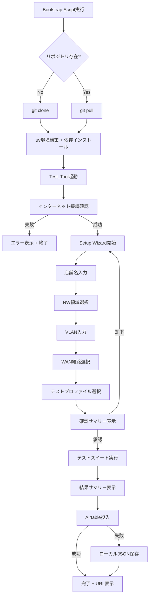
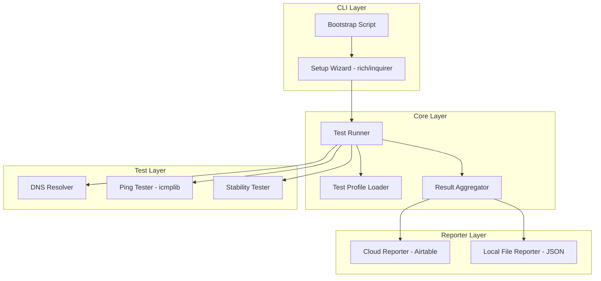
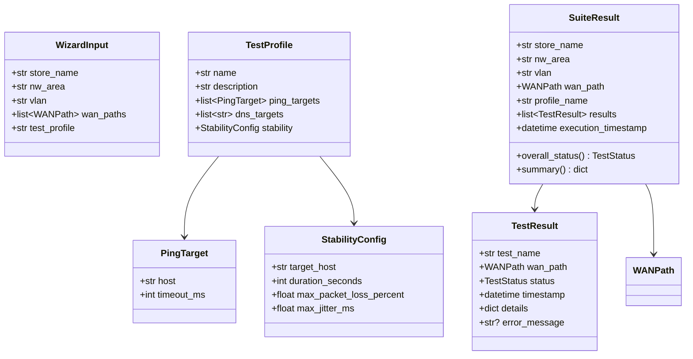

# 設計ドキュメント: 店舗ネットワークテスト自動化ツール

## Overview

本ツール（Test_Tool）は、店舗現場のネットワーク構築・変更後に、名前解決・NW到達性・安定性の3種類のテストを自動実行するPython CLIアプリケーションである。

### 設計方針

- **「小さく始めて、賢く構築する」**: Phase 1では基本テスト（接続・安定性）に絞り、Phase 2で網羅テスト・フェイルオーバーテストを追加
- **クロスプラットフォーム**: OS固有コマンドに依存せず、Pythonライブラリで統一
- **ワンコマンド起動**: Bootstrap Scriptで環境構築からツール起動まで一気通貫
- **オフライン耐性**: Airtable投入失敗時はローカルJSONにフォールバック

### 主要フロー



## Architecture

### レイヤー構成



### ディレクトリ構成

```
store-network-test-automation/
├── bootstrap.py              # クロスプラットフォームブートストラップスクリプト
├── pyproject.toml             # uv/プロジェクト設定
├── profiles/
│   └── default.json           # デフォルトテストプロファイル
├── src/
│   └── store_net_test/
│       ├── __init__.py
│       ├── main.py            # エントリーポイント
│       ├── wizard.py          # Setup Wizard（対話入力）
│       ├── runner.py          # テストスイート実行エンジン
│       ├── profile.py         # テストプロファイル読み込み・バリデーション
│       ├── tests/
│       │   ├── __init__.py
│       │   ├── dns.py         # DNS解決テスト
│       │   ├── ping.py        # ICMP pingテスト
│       │   └── stability.py   # 安定性テスト
│       ├── reporters/
│       │   ├── __init__.py
│       │   ├── airtable.py    # Airtable投入
│       │   └── local.py       # ローカルJSONフォールバック
│       └── utils/
│           ├── __init__.py
│           ├── network.py     # インターネット接続確認等
│           └── platform.py    # OS判定・プラットフォームユーティリティ
└── tests/                     # テストコード
    ├── __init__.py
    ├── test_profile.py
    ├── test_dns.py
    ├── test_ping.py
    ├── test_stability.py
    ├── test_wizard.py
    ├── test_runner.py
    └── test_reporter.py
```

### 技術スタック

| カテゴリ | 選定 | 理由 |
|---------|------|------|
| 言語 | Python 3.11+ | 現場PCでの互換性、uvとの親和性 |
| パッケージ管理 | uv | 高速、ワンコマンドでの環境構築に最適 |
| CLI対話 | rich + questionary | リッチなTUI、クロスプラットフォーム対応 |
| Ping | icmplib | Pure Python ICMP実装、OS非依存 |
| DNS | dnspython | クロスプラットフォームDNS解決 |
| HTTP | httpx | Airtable API呼び出し、リトライ対応 |
| 設定 | JSON (標準ライブラリ) | テストプロファイル定義 |
| テスト | pytest + hypothesis | ユニットテスト + プロパティベーステスト |


## Components and Interfaces

### 1. Bootstrap Script (`bootstrap.py`)

Pythonベースのブートストラップスクリプト。OS非依存で動作する。

```python
# インターフェース概要
def main() -> None:
    """ブートストラップのエントリーポイント"""
    ...

def clone_or_pull_repo(repo_url: str, target_dir: Path) -> None:
    """リポジトリのクローンまたはプル"""
    ...

def setup_uv_environment(project_dir: Path) -> None:
    """uv環境のセットアップと依存インストール"""
    ...

def check_internet_connectivity() -> bool:
    """インターネット接続確認"""
    ...

def launch_tool(project_dir: Path) -> None:
    """Test_Toolの起動"""
    ...
```

**設計判断**: Bootstrap ScriptをPythonで実装することで、shell/batch/PowerShellの3種類を用意する必要がなくなる。ただし、初回実行時にPythonが必要となるため、READMEにPython 3.11+のインストール手順を記載する。`uv`自体はbootstrap.pyが自動インストールする。

### 2. Setup Wizard (`wizard.py`)

`questionary`ライブラリを使用した対話型入力インターフェース。

```python
from dataclasses import dataclass
from enum import Enum

class WANPath(Enum):
    FTTH = "ftth"
    LTE = "lte"

@dataclass
class WizardInput:
    store_name: str
    nw_area: str
    vlan: str
    wan_paths: list[WANPath]
    test_profile: str

def run_wizard(available_profiles: list[ProfileSummary], nw_areas: list[str]) -> WizardInput:
    """ウィザードを実行し、入力結果を返す"""
    ...

def validate_store_name(name: str) -> str | None:
    """店舗名バリデーション。エラー時はメッセージを返す"""
    ...

def validate_vlan(vlan: str) -> str | None:
    """VLANバリデーション。エラー時はメッセージを返す"""
    ...

def display_confirmation(inputs: WizardInput) -> bool:
    """確認サマリーを表示し、承認/却下を返す"""
    ...
```

**設計判断**: `questionary`はクロスプラットフォームで動作し、選択肢・テキスト入力・バリデーションを統一的に扱える。`rich`と組み合わせてカラフルな表示を実現する。

### 3. Test Profile Loader (`profile.py`)

JSONファイルからテストプロファイルを読み込み、バリデーションする。

```python
from dataclasses import dataclass

@dataclass
class PingTarget:
    host: str
    timeout_ms: int

@dataclass
class StabilityConfig:
    target_host: str
    duration_seconds: int
    max_packet_loss_percent: float
    max_jitter_ms: float

@dataclass
class TestProfile:
    name: str
    description: str
    ping_targets: list[PingTarget]
    dns_targets: list[str]
    stability: StabilityConfig

def load_profiles(profiles_dir: Path) -> list[TestProfile]:
    """プロファイルディレクトリから全プロファイルを読み込む"""
    ...

def parse_profile(data: dict) -> TestProfile:
    """辞書からTestProfileオブジェクトを生成"""
    ...

def profile_to_dict(profile: TestProfile) -> dict:
    """TestProfileオブジェクトを辞書に変換"""
    ...

def validate_profile(profile: TestProfile) -> list[str]:
    """プロファイルのバリデーション。エラーメッセージのリストを返す"""
    ...
```

### 4. Test Runner (`runner.py`)

テストスイートの実行を管理する。

```python
from dataclasses import dataclass
from enum import Enum
from datetime import datetime

class TestStatus(Enum):
    PASS = "pass"
    FAIL = "fail"
    WARNING = "warning"
    ERROR = "error"

@dataclass
class TestResult:
    test_name: str
    wan_path: WANPath
    status: TestStatus
    timestamp: datetime
    details: dict  # テスト固有の詳細データ
    error_message: str | None = None

@dataclass
class SuiteResult:
    store_name: str
    nw_area: str
    vlan: str
    wan_path: WANPath
    profile_name: str
    results: list[TestResult]
    execution_timestamp: datetime

    @property
    def overall_status(self) -> TestStatus:
        """全テスト結果から総合ステータスを算出"""
        ...

    @property
    def summary(self) -> dict[TestStatus, int]:
        """ステータス別のカウントを返す"""
        ...

async def run_test_suite(
    profile: TestProfile,
    wan_path: WANPath,
    wizard_input: WizardInput,
) -> SuiteResult:
    """指定WAN経路でテストスイートを実行"""
    ...

def display_summary(results: list[SuiteResult]) -> None:
    """結果サマリーをコンソールに表示"""
    ...
```

**設計判断**: テスト実行は同期的に順次実行する（Phase 1）。各テスト項目が失敗してもスキップして次に進む設計とし、全テスト完了後にサマリーを表示する。

### 5. テスト実装モジュール (`tests/`)

```python
# dns.py
async def run_dns_test(targets: list[str], wan_path: WANPath) -> list[TestResult]:
    """DNS解決テストを実行"""
    ...

# ping.py
async def run_ping_test(targets: list[PingTarget], wan_path: WANPath) -> list[TestResult]:
    """Ping到達性テストを実行"""
    ...

# stability.py
async def run_stability_test(config: StabilityConfig, wan_path: WANPath) -> list[TestResult]:
    """安定性テストを実行"""
    ...
```

**設計判断**: `icmplib`のasync APIを使用。DNS解決には`dnspython`を使用し、OS固有の`nslookup`や`dig`コマンドに依存しない。

### 6. Cloud Reporter (`reporters/airtable.py`)

```python
@dataclass
class AirtableConfig:
    api_key: str
    base_id: str
    table_name: str

def load_airtable_config() -> AirtableConfig:
    """環境変数またはローカル設定ファイルからAirtable設定を読み込む"""
    ...

async def submit_results(
    config: AirtableConfig,
    suite_result: SuiteResult,
    max_retries: int = 3,
) -> str | None:
    """結果をAirtableに投入。成功時はレコードURLを返す"""
    ...

def build_airtable_record(suite_result: SuiteResult) -> dict:
    """SuiteResultからAirtableレコード用の辞書を構築"""
    ...
```

### 7. Local File Reporter (`reporters/local.py`)

```python
def save_results_to_json(suite_result: SuiteResult, output_dir: Path) -> Path:
    """結果をローカルJSONファイルに保存。ファイルパスを返す"""
    ...

def suite_result_to_dict(suite_result: SuiteResult) -> dict:
    """SuiteResultをJSON直列化可能な辞書に変換"""
    ...
```


## Data Models

### テストプロファイル JSON スキーマ

```json
{
  "name": "standard",
  "description": "標準店舗テストプロファイル",
  "ping_targets": [
    { "host": "8.8.8.8", "timeout_ms": 1000 },
    { "host": "1.1.1.1", "timeout_ms": 1000 }
  ],
  "dns_targets": [
    "www.google.com",
    "dns.google"
  ],
  "stability": {
    "target_host": "8.8.8.8",
    "duration_seconds": 30,
    "max_packet_loss_percent": 5.0,
    "max_jitter_ms": 50.0
  }
}
```

### テスト結果 JSON スキーマ（ローカルフォールバック用）

```json
{
  "store_name": "渋谷店",
  "nw_area": "バックヤード",
  "vlan": "VLAN100",
  "wan_path": "ftth",
  "profile_name": "standard",
  "execution_timestamp": "2024-01-15T10:30:00+09:00",
  "overall_status": "pass",
  "results": [
    {
      "test_name": "ping_8.8.8.8",
      "wan_path": "ftth",
      "status": "pass",
      "timestamp": "2024-01-15T10:30:01+09:00",
      "details": {
        "rtt_ms": 12.5,
        "threshold_ms": 1000
      },
      "error_message": null
    },
    {
      "test_name": "dns_www.google.com",
      "wan_path": "ftth",
      "status": "pass",
      "timestamp": "2024-01-15T10:30:02+09:00",
      "details": {
        "resolved_ip": "142.250.196.100",
        "resolution_time_ms": 25.3
      },
      "error_message": null
    },
    {
      "test_name": "stability_8.8.8.8",
      "wan_path": "ftth",
      "status": "pass",
      "timestamp": "2024-01-15T10:30:32+09:00",
      "details": {
        "packet_loss_percent": 0.5,
        "jitter_ms": 3.2,
        "duration_seconds": 30,
        "packets_sent": 30,
        "packets_received": 30
      },
      "error_message": null
    }
  ]
}
```

### Airtable レコード構造

| フィールド名 | 型 | 説明 |
|-------------|-----|------|
| Store Name | Single line text | 店舗名 |
| NW Area | Single line text | ネットワーク領域 |
| VLAN | Single line text | VLAN識別子 |
| WAN Path | Single select | FTTH / LTE |
| Execution Time | Date time | テスト実行日時 |
| Profile | Single line text | テストプロファイル名 |
| Overall Status | Single select | pass / fail / warning |
| Results JSON | Long text | 個別テスト結果のJSON文字列 |
| Passed Count | Number | 合格テスト数 |
| Failed Count | Number | 不合格テスト数 |
| Warning Count | Number | 警告テスト数 |

### 主要データクラス関係図




## Correctness Properties

*プロパティとは、システムの全ての有効な実行において真であるべき特性や振る舞いのことである。人間が読める仕様と機械的に検証可能な正しさの保証を橋渡しする、形式的な記述である。*

### Property 1: テストプロファイルのラウンドトリップ

*For any* 有効なTestProfileオブジェクトに対して、`profile_to_dict`で辞書に変換し、`parse_profile`でTestProfileに戻した結果は、元のTestProfileと等価でなければならない。

**Validates: Requirements 7.5**

### Property 2: 入力バリデーションの一貫性

*For any* 文字列入力に対して、店舗名バリデータ(`validate_store_name`)は空文字列・空白のみの文字列に対してエラーメッセージを返し、1文字以上の非空白文字を含む文字列に対してはNoneを返さなければならない。同様に、VLANバリデータ(`validate_vlan`)は不正な形式に対してエラーメッセージを返し、有効な形式に対してはNoneを返さなければならない。

**Validates: Requirements 2.8**

### Property 3: 確認サマリーの完全性

*For any* 有効なWizardInputに対して、`display_confirmation`が生成するサマリー文字列は、store_name、nw_area、vlan、wan_paths、test_profileの全フィールドの値を含まなければならない。

**Validates: Requirements 2.6**

### Property 4: テスト実行の網羅性と順序

*For any* テストプロファイル（N個のテスト項目）と選択されたWAN経路リスト（M個）に対して、テストスイート実行後のTestResult数はN×M個でなければならない。また、WAN経路が[FTTH, LTE]の順で選択された場合、全てのFTTH結果のタイムスタンプは全てのLTE結果のタイムスタンプより前でなければならない。

**Validates: Requirements 3.1, 3.2**

### Property 5: テスト結果の構造的完全性

*For any* 完了したテスト項目に対して、生成されるTestResultはtest_name（非空文字列）、wan_path（有効なWANPath値）、status（有効なTestStatus値）、timestamp（有効なdatetime）を全て含まなければならない。

**Validates: Requirements 3.3**

### Property 6: テスト実行のエラー耐性

*For any* テストスイートにおいて、1つのテスト項目がシステムエラーで失敗した場合でも、残りのテスト項目は全て実行され、結果が記録されなければならない。つまり、エラーが発生したテスト項目を除く全テスト項目の結果がSuiteResultに含まれなければならない。

**Validates: Requirements 3.5**

### Property 7: 結果サマリーの正確性

*For any* SuiteResultに対して、`summary`プロパティが返すpass/fail/warningの各カウントは、results内の各TestResultのstatusを集計した値と一致しなければならない。また、`overall_status`は、1つでもfailがあればfail、failがなくwarningがあればwarning、それ以外はpassでなければならない。

**Validates: Requirements 3.6**

### Property 8: Ping閾値判定の正確性

*For any* ping応答時間（RTT）と閾値の組み合わせに対して、RTT ≤ 閾値ならステータスは"pass"、RTT > 閾値またはタイムアウトならステータスは"fail"でなければならない。

**Validates: Requirements 4.3, 4.4**

### Property 9: パケットロス率の計算正確性

*For any* 送信パケット数（sent > 0）と受信パケット数（0 ≤ received ≤ sent）に対して、計算されるパケットロス率は `(sent - received) / sent * 100` と等しくなければならない。

**Validates: Requirements 5.2**

### Property 10: ジッター計算の正確性

*For any* 2つ以上のRTT値のリストに対して、計算されるジッターは連続するRTT値の差の絶対値の平均と等しくなければならない。

**Validates: Requirements 5.3**

### Property 11: 安定性閾値判定の正確性

*For any* パケットロス率・ジッター値と各閾値の組み合わせに対して、パケットロス率が閾値を超過した場合、またはジッターが閾値を超過した場合、ステータスは"fail"でなければならない。両方が閾値以内であればステータスは"pass"でなければならない。

**Validates: Requirements 5.4, 5.5**

### Property 12: Airtableレコードの構造的完全性

*For any* 有効なSuiteResultに対して、`build_airtable_record`が生成する辞書は、store_name、nw_area、vlan、wan_path、execution_timestamp、profile_name、overall_status、individual resultsの全フィールドを含まなければならない。

**Validates: Requirements 6.2**

### Property 13: WAN経路別レコード分離

*For any* 複数のWAN経路を含むテスト結果リストに対して、Cloud_Reporterが生成するAirtableレコード数は、WAN経路の数と一致しなければならない。各レコードは1つのWAN経路の結果のみを含まなければならない。

**Validates: Requirements 6.3**

### Property 14: ローカルJSON保存のラウンドトリップ

*For any* 有効なSuiteResultに対して、`suite_result_to_dict`で辞書に変換し、JSONに直列化し、JSONからデシリアライズして辞書に戻した結果は、元の辞書と等価でなければならない。

**Validates: Requirements 6.5**


## Error Handling

### エラーカテゴリと対応方針

| カテゴリ | 発生箇所 | 対応 |
|---------|---------|------|
| ネットワーク未接続 | Bootstrap, 起動時チェック | エラーメッセージ表示 + 終了 |
| Git操作失敗 | Bootstrap | エラーメッセージ表示 + 終了 |
| uv環境構築失敗 | Bootstrap | 失敗理由を含むエラーメッセージ表示 + 終了 |
| プロファイルJSON不正 | プロファイル読み込み | パースエラー理由を表示 + 終了 |
| 入力バリデーション失敗 | Setup Wizard | エラーメッセージ表示 + 再入力促進 |
| テスト項目実行エラー | Test Runner | エラーログ記録 + スキップ + 次のテスト継続 |
| Airtable API エラー | Cloud Reporter | 最大3回リトライ（指数バックオフ） |
| Airtable全リトライ失敗 | Cloud Reporter | ローカルJSON保存 + エラーメッセージ表示 |
| 未サポートOS検出 | 起動時 | サポートOS一覧表示 + 終了 |

### リトライ戦略（Airtable投入）

```python
# 指数バックオフの実装方針
# リトライ間隔: 1秒 → 2秒 → 4秒
MAX_RETRIES = 3
BASE_DELAY_SECONDS = 1.0

async def submit_with_retry(config: AirtableConfig, record: dict) -> str | None:
    for attempt in range(MAX_RETRIES):
        try:
            return await submit_to_airtable(config, record)
        except AirtableAPIError:
            if attempt < MAX_RETRIES - 1:
                delay = BASE_DELAY_SECONDS * (2 ** attempt)
                await asyncio.sleep(delay)
    return None  # 全リトライ失敗
```

### エラーメッセージの方針

- 全てのエラーメッセージは日本語で表示
- 技術的な詳細（例外メッセージ等）は英語のまま付記
- `rich`ライブラリを使用して、エラーは赤色、警告は黄色で表示
- 例: `❌ インターネット接続を確認できません。ネットワーク接続を確認してください。`
- 例: `⚠️ Airtableへの投入に失敗しました。ローカルに保存しました: ./results/2024-01-15_渋谷店.json`

## Testing Strategy

### テストフレームワーク

- **ユニットテスト**: `pytest`
- **プロパティベーステスト**: `hypothesis`
- **モック**: `pytest-mock` + `unittest.mock`

### テスト構成

#### ユニットテスト（具体例・エッジケース・エラー条件）

| テスト対象 | テスト内容 |
|-----------|-----------|
| Bootstrap | リポジトリ存在時のpull動作（Req 1.5） |
| Bootstrap | インターネット未接続時のエラー表示（Req 1.6） |
| Bootstrap | uv失敗時のエラー表示（Req 1.7） |
| Wizard | ウィザードステップの順序（Req 2.1-2.5） |
| Wizard | 確認却下時の再開（Req 2.7） |
| Wizard | デフォルト値の提供（Req 2.9, 2.10） |
| Profile | 不正JSONのエラーハンドリング（Req 7.3） |
| Profile | デフォルトプロファイルの存在（Req 7.4） |
| DNS | DNS解決失敗時のfailマーク（Req 4.5） |
| Reporter | Airtable 3回リトライ動作（Req 6.4） |
| Reporter | 全リトライ失敗時のローカル保存（Req 6.5） |
| Reporter | 成功時のURL表示（Req 6.6） |
| Reporter | 環境変数/設定ファイルからの設定読み込み（Req 6.7） |
| Network | インターネット接続確認（Req 8.1-8.3） |
| Platform | 未サポートOS検出（Req 9.7） |

#### プロパティベーステスト（全入力に対する普遍的性質）

各プロパティテストは最低100イテレーション実行する。各テストにはコメントで設計ドキュメントのプロパティ番号を参照する。

| Property | テストファイル | タグ |
|----------|-------------|------|
| Property 1 | test_profile.py | Feature: store-network-test-automation, Property 1: テストプロファイルのラウンドトリップ |
| Property 2 | test_wizard.py | Feature: store-network-test-automation, Property 2: 入力バリデーションの一貫性 |
| Property 3 | test_wizard.py | Feature: store-network-test-automation, Property 3: 確認サマリーの完全性 |
| Property 4 | test_runner.py | Feature: store-network-test-automation, Property 4: テスト実行の網羅性と順序 |
| Property 5 | test_runner.py | Feature: store-network-test-automation, Property 5: テスト結果の構造的完全性 |
| Property 6 | test_runner.py | Feature: store-network-test-automation, Property 6: テスト実行のエラー耐性 |
| Property 7 | test_runner.py | Feature: store-network-test-automation, Property 7: 結果サマリーの正確性 |
| Property 8 | test_ping.py | Feature: store-network-test-automation, Property 8: Ping閾値判定の正確性 |
| Property 9 | test_stability.py | Feature: store-network-test-automation, Property 9: パケットロス率の計算正確性 |
| Property 10 | test_stability.py | Feature: store-network-test-automation, Property 10: ジッター計算の正確性 |
| Property 11 | test_stability.py | Feature: store-network-test-automation, Property 11: 安定性閾値判定の正確性 |
| Property 12 | test_reporter.py | Feature: store-network-test-automation, Property 12: Airtableレコードの構造的完全性 |
| Property 13 | test_reporter.py | Feature: store-network-test-automation, Property 13: WAN経路別レコード分離 |
| Property 14 | test_reporter.py | Feature: store-network-test-automation, Property 14: ローカルJSON保存のラウンドトリップ |

#### Hypothesisストラテジー例

```python
from hypothesis import given, settings, strategies as st

# テストプロファイルのジェネレータ
ping_target_strategy = st.builds(
    PingTarget,
    host=st.from_regex(r"\d{1,3}\.\d{1,3}\.\d{1,3}\.\d{1,3}", fullmatch=True),
    timeout_ms=st.integers(min_value=100, max_value=10000),
)

stability_config_strategy = st.builds(
    StabilityConfig,
    target_host=st.from_regex(r"\d{1,3}\.\d{1,3}\.\d{1,3}\.\d{1,3}", fullmatch=True),
    duration_seconds=st.integers(min_value=5, max_value=300),
    max_packet_loss_percent=st.floats(min_value=0.0, max_value=100.0, allow_nan=False),
    max_jitter_ms=st.floats(min_value=0.0, max_value=1000.0, allow_nan=False),
)

test_profile_strategy = st.builds(
    TestProfile,
    name=st.text(min_size=1, max_size=50),
    description=st.text(max_size=200),
    ping_targets=st.lists(ping_target_strategy, min_size=1, max_size=10),
    dns_targets=st.lists(st.from_regex(r"[a-z][a-z0-9\-\.]{1,50}", fullmatch=True), min_size=1, max_size=10),
    stability=stability_config_strategy,
)

# Property 1: ラウンドトリップテスト例
# Feature: store-network-test-automation, Property 1: テストプロファイルのラウンドトリップ
@given(profile=test_profile_strategy)
@settings(max_examples=100)
def test_profile_round_trip(profile: TestProfile):
    result = parse_profile(profile_to_dict(profile))
    assert result == profile
```

### テスト実行方法

```bash
# 全テスト実行
uv run pytest tests/ -v

# プロパティベーステストのみ
uv run pytest tests/ -v -k "property"

# 特定モジュールのテスト
uv run pytest tests/test_profile.py -v
```
