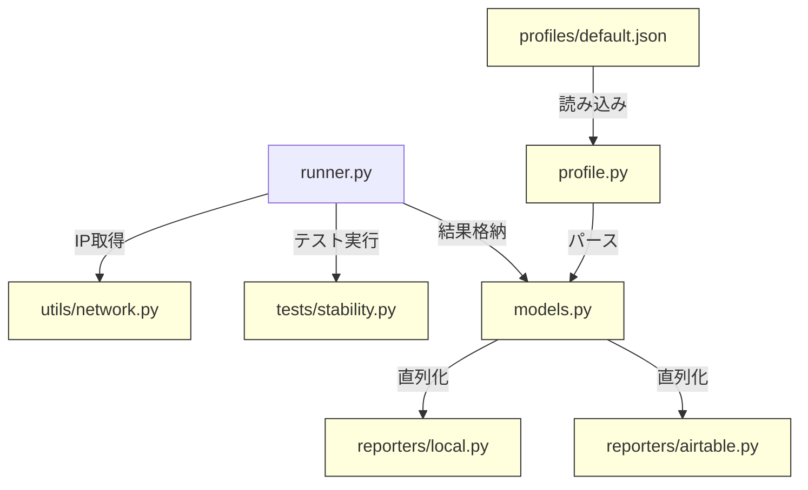

# 設計ドキュメント: VLAN IPアドレス記録 & 安定性テスト高速化

## Overview

本設計は、店舗ネットワークテスト自動化ツールに対する2つの機能改善を実現する。

1. **VLAN IPアドレス記録**: 各VLANテスト実行時にNICのローカルIPアドレスを`socket.gethostbyname(socket.gethostname())`で取得し、`SuiteResult`に記録する。取得失敗時はNoneを格納し、例外を発生させない。
2. **安定性テスト高速化**: `StabilityConfig`に`ping_interval`フィールドを追加し、デフォルト0.2秒のping間隔で`duration_seconds=5`と組み合わせることで、約5秒・約25パケットでテストを完了する。

設計方針は「小さく始めて、賢く構築する」に従い、既存コードへの変更を最小限に抑える。

## Architecture

変更対象のモジュールと依存関係:



黄色のモジュールが変更対象。変更は以下の3レイヤーに分類される:

- **データ層**: `models.py`（`SuiteResult`に`local_ip`追加、`StabilityConfig`に`ping_interval`追加）
- **ロジック層**: `utils/network.py`（`get_local_ip`関数追加）、`tests/stability.py`（`ping_interval`利用）、`runner.py`（IP取得・表示）
- **入出力層**: `profile.py`（`ping_interval`パース）、`reporters/local.py`・`reporters/airtable.py`（`local_ip`出力）、`profiles/default.json`（設定値更新）

## Components and Interfaces

### 1. `utils/network.py` — `get_local_ip()` 関数追加

```python
def get_local_ip() -> str | None:
    """アクティブNICのローカルIPアドレスを取得する

    UDPソケットで外部ホストへの接続を試み、バインドされたローカルIPを返す。
    取得失敗時はNoneを返し、例外を発生させない。

    Returns:
        ローカルIPアドレス文字列、または取得失敗時None
    """
```

実装方針: `socket.socket(AF_INET, SOCK_DGRAM)`で`8.8.8.8:80`にconnectし、`getsockname()[0]`でローカルIPを取得する。実際のパケットは送信されない。

### 2. `models.py` — データモデル変更

**SuiteResult**: `local_ip: str | None = None` フィールド追加（後方互換性のためデフォルトNone）

**StabilityConfig**: `ping_interval: float = 0.2` フィールド追加（デフォルト0.2秒）

### 3. `tests/stability.py` — ping_interval利用

`run_stability_test`内のicmplib `ping()`呼び出しで、`interval`パラメータに`config.ping_interval`を使用する。送信パケット数は`int(config.duration_seconds / config.ping_interval)`で算出する。

### 4. `runner.py` — IP取得・表示・格納

`_run_tests_for_wan_path`内で:
1. テスト開始前に`get_local_ip()`を呼び出す
2. 取得したIPをコンソールに表示（None時は警告表示）
3. `SuiteResult`の`local_ip`フィールドに格納する

### 5. `profile.py` — ping_intervalパース・直列化

`parse_profile`: `stability`辞書から`ping_interval`を読み込む（キー不在時はデフォルト0.2）
`profile_to_dict`: `ping_interval`を辞書に含める
`validate_profile`: `ping_interval`が正の値であることを検証する

### 6. `reporters/local.py` — local_ip出力

`suite_result_to_dict`: 出力辞書に`local_ip`フィールドを追加する

### 7. `reporters/airtable.py` — local_ip出力

`build_airtable_record`: Webhookペイロードに`local_ip`フィールドを追加する

### 8. `profiles/default.json` — 設定値更新

`stability.duration_seconds`を`5`に、`stability.ping_interval`を`0.2`に変更する。

## Data Models

### SuiteResult（変更後）

```python
@dataclass
class SuiteResult:
    store_code: str
    vlan_type: str
    wan_path: WANPath
    profile_name: str
    results: list[TestResult]
    execution_timestamp: datetime
    local_ip: str | None = None  # 新規追加
```

### StabilityConfig（変更後）

```python
@dataclass
class StabilityConfig:
    target_host: str
    duration_seconds: int
    max_packet_loss_percent: float
    max_jitter_ms: float
    ping_interval: float = 0.2  # 新規追加（秒）
```

### JSON出力例（ローカルレポーター）

```json
{
  "store_code": "0001",
  "vlan_type": "店舗",
  "wan_path": "ftth",
  "local_ip": "192.168.1.100",
  "profile_name": "standard",
  "overall_status": "pass",
  "results": [...]
}
```

### プロファイルJSON例（default.json stability部分）

```json
{
  "stability": {
    "target_host": "8.8.8.8",
    "duration_seconds": 5,
    "max_packet_loss_percent": 5.0,
    "max_jitter_ms": 50.0,
    "ping_interval": 0.2
  }
}
```


## Correctness Properties

*プロパティとは、システムのすべての有効な実行において成り立つべき特性や振る舞いのことである。プロパティは、人間が読める仕様と機械が検証可能な正しさの保証との橋渡しとなる。*

### Property 1: get_local_ipは有効なIPv4文字列またはNoneを返す

*For any* 実行環境において、`get_local_ip()`の戻り値は、有効なIPv4アドレス文字列（`ipaddress.ip_address()`でパース可能）またはNoneのいずれかである。それ以外の値や例外は発生しない。

**Validates: Requirements 1.1, 1.2**

### Property 2: SuiteResultのローカルレポーター直列化にlocal_ipが含まれる

*For any* `SuiteResult`（`local_ip`がstr or Noneのいずれか）に対して、`suite_result_to_dict()`の出力辞書には`local_ip`キーが存在し、その値は元の`SuiteResult.local_ip`と等しい。

**Validates: Requirements 2.1, 2.3**

### Property 3: SuiteResultのAirtableレポーター直列化にlocal_ipが含まれる

*For any* `SuiteResult`（`local_ip`がstr or Noneのいずれか）に対して、`build_airtable_record()`の出力辞書には`local_ip`キーが存在し、その値は元の`SuiteResult.local_ip`と等しい。

**Validates: Requirements 2.1, 2.4**

### Property 4: 安定性テストのパケット数計算

*For any* 正の`duration_seconds`と正の`ping_interval`に対して、算出されるパケット数`int(duration_seconds / ping_interval)`は1以上であり、`duration_seconds`と`ping_interval`の比率に一致する。

**Validates: Requirements 4.3**

### Property 5: StabilityConfig付きプロファイルのラウンドトリップ

*For any* 有効な`TestProfile`（`ping_interval`を含む`StabilityConfig`付き）に対して、`profile_to_dict(profile)`を`parse_profile()`に渡した結果は元のプロファイルと等価であり、`ping_interval`の値が保持される。

**Validates: Requirements 4.1**

## Error Handling

| シナリオ | 対処 | 影響範囲 |
|---|---|---|
| `get_local_ip()`でソケットエラー | Noneを返す。例外は発生させない | `SuiteResult.local_ip`がNoneになる |
| `local_ip=None`時のJSON直列化 | `"local_ip": null`として出力 | レポート上はnull表示 |
| `local_ip=None`時のAirtable投入 | `"local_ip": null`としてペイロードに含める | Airtable側でnull処理 |
| `ping_interval`がプロファイルに未指定 | デフォルト値0.2を使用 | 後方互換性を維持 |
| `ping_interval`が0以下 | `validate_profile`でエラー検出 | プロファイル読み込み時にValueError |
| icmplib ping呼び出し失敗 | 既存のtry/exceptでFAIL結果を返す | 安定性テスト結果がFAILになる |

## Testing Strategy

### テストライブラリ

- **ユニットテスト**: pytest
- **プロパティベーステスト**: Hypothesis（Python用PBTライブラリ）
- 各プロパティテストは最低100イテレーション実行する（`@settings(max_examples=100)`）

### プロパティベーステスト

各Correctness Propertyに対して1つのプロパティベーステストを実装する。

| Property | テストファイル | タグ |
|---|---|---|
| Property 1 | `tests/test_network.py` | `Feature: vlan-ip-logging-and-stability-speedup, Property 1: get_local_ipは有効なIPv4文字列またはNoneを返す` |
| Property 2 | `tests/test_reporter.py` | `Feature: vlan-ip-logging-and-stability-speedup, Property 2: SuiteResultのローカルレポーター直列化にlocal_ipが含まれる` |
| Property 3 | `tests/test_reporter.py` | `Feature: vlan-ip-logging-and-stability-speedup, Property 3: SuiteResultのAirtableレポーター直列化にlocal_ipが含まれる` |
| Property 4 | `tests/test_stability.py` | `Feature: vlan-ip-logging-and-stability-speedup, Property 4: 安定性テストのパケット数計算` |
| Property 5 | `tests/test_profile.py` | `Feature: vlan-ip-logging-and-stability-speedup, Property 5: StabilityConfig付きプロファイルのラウンドトリップ` |

### ユニットテスト（例・エッジケース）

| テスト対象 | 内容 | 対応要件 |
|---|---|---|
| `get_local_ip()` | ソケットエラー時にNoneを返す | 1.2 |
| `SuiteResult` | `local_ip=None`で正常動作 | 2.2 |
| `parse_profile` | `ping_interval`未指定時にデフォルト0.2 | 4.2 |
| `run_stability_test` | `config.ping_interval`がicmplib pingのintervalに渡される | 4.4 |
| `default.json` | `duration_seconds=5`, `ping_interval=0.2` | 5.1, 5.2 |
| Runner | IP取得・コンソール表示（モック） | 3.1, 3.2 |
