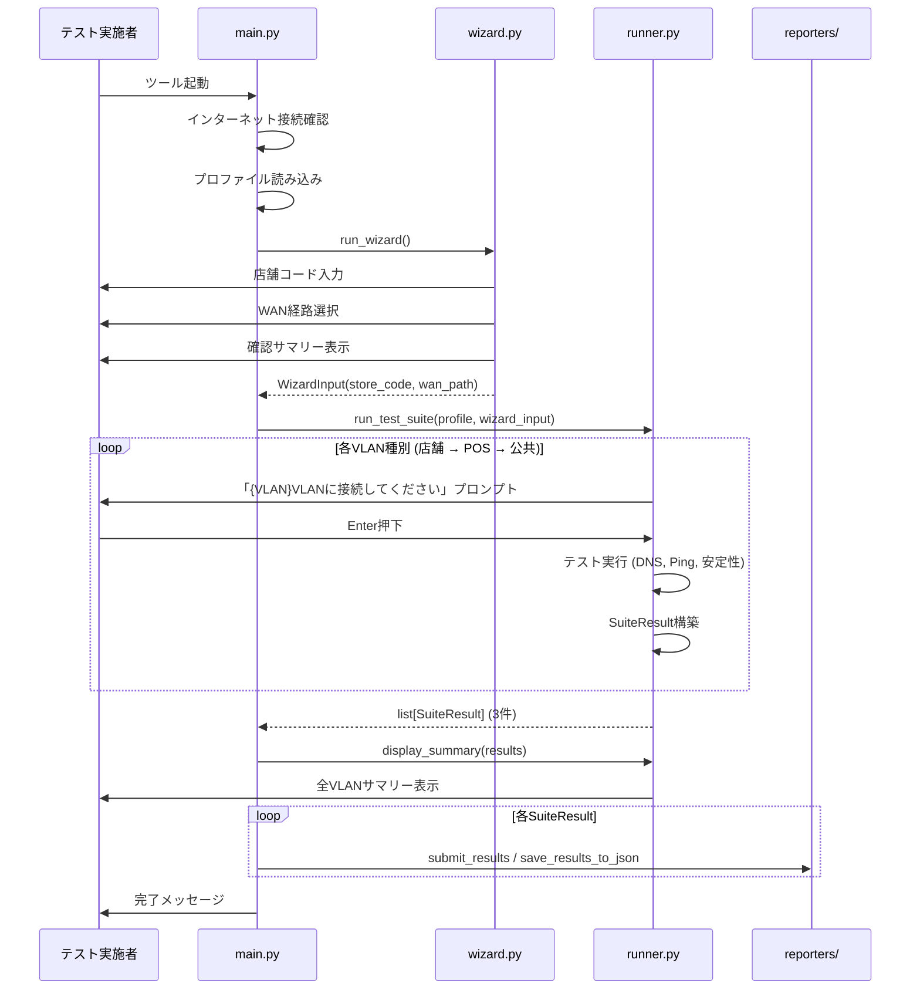

# Design Document: VLAN順次テスト

## Overview

現在のウィザードは3ステップ構成（店舗コード → VLAN種別選択 → WAN経路選択）で、ユーザーが1つのVLAN種別を選択してテストを実行する。本変更では、VLAN種別の選択ステップを削除し、全VLAN種別（店舗・POS・公共）を順次テストする方式に変更する。

### 変更の要点

- ウィザードを2ステップ（店舗コード → WAN経路）に簡素化
- `WizardInput` から `vlan_type` フィールドを削除
- テスト実行フローで全VLAN種別を順次テスト（各VLAN切替前にユーザーへ接続準備プロンプト表示）
- `run_test_suite` の戻り値を `SuiteResult` → `list[SuiteResult]` に変更
- `display_summary` の引数を `list[SuiteResult]` に変更
- `main.py` で複数 `SuiteResult` のAirtable投入・サマリー表示に対応
- Local Reporter のファイル名に `vlan_type` を含める

### 影響範囲

| モジュール | 変更内容 |
|---|---|
| `models.py` | `WizardInput` から `vlan_type` 削除 |
| `wizard.py` | VLAN種別選択ステップ削除、確認サマリー更新 |
| `runner.py` | 順次VLANテストフロー実装、`run_test_suite` 戻り値変更、`display_summary` 引数変更 |
| `main.py` | `list[SuiteResult]` 対応、Airtable個別投入 |
| `reporters/local.py` | ファイル名に `vlan_type` 追加 |
| `reporters/airtable.py` | 変更なし（既に `vlan_type` 対応済み） |
| `tests/` | テストヘルパー・テストケース更新 |

## Architecture

### 変更後のフロー



### 設計方針

1. **最小限の変更**: 既存のテスト実行ロジック（`_run_tests_for_wan_path`）はそのまま再利用し、外側のループで VLAN 種別を順次切り替える
2. **WizardInput の簡素化**: `vlan_type` を削除し、VLAN種別はランナー内部で管理する定数リストから取得
3. **SuiteResult は変更なし**: `SuiteResult.vlan_type` フィールドは既存のまま保持。ランナーが各VLANテスト時に適切な値を設定する
4. **Reporter は既に対応済み**: `build_airtable_record` と `suite_result_to_dict` は既に `vlan_type` を出力に含めている

## Components and Interfaces

### wizard.py の変更

```python
# 削除: VLAN_TYPE_CHOICES 定数
# 削除: VLAN種別選択ステップ

def run_wizard() -> WizardInput:
    """2ステップ構成: 店舗コード → WAN経路"""
    ...

def _build_confirmation_text(inputs: WizardInput) -> str:
    """確認サマリー: VLAN種別行を削除、全VLANテスト対象の情報を追加"""
    ...

def display_confirmation(inputs: WizardInput) -> bool:
    """確認サマリー表示: VLAN種別行を削除、全VLANテスト対象行を追加"""
    ...
```

### models.py の変更

```python
@dataclass
class WizardInput:
    """Setup Wizardの入力結果"""
    store_code: str
    wan_path: WANPath
    # vlan_type フィールドを削除
```

### runner.py の変更

```python
# 順次テスト対象のVLAN種別リスト
VLAN_TYPES: list[str] = ["店舗", "POS", "公共"]

def prompt_vlan_connection(vlan_type: str) -> None:
    """VLAN接続準備プロンプトを表示し、Enterを待つ"""
    ...

def run_test_suite(
    profile: TestProfile,
    wizard_input: WizardInput,
) -> list[SuiteResult]:
    """全VLAN種別を順次テストし、list[SuiteResult]を返す"""
    ...

def display_summary(suite_results: list[SuiteResult]) -> None:
    """全VLANの結果サマリーを表示する"""
    ...
```

### main.py の変更

```python
def _run() -> None:
    # ...
    # run_test_suite の戻り値を list[SuiteResult] で受け取る
    suite_results = run_test_suite(selected_profile, wizard_input)

    # 全VLANサマリー表示
    display_summary(suite_results)

    # 各SuiteResultを個別にAirtable投入
    if webhook_config is not None:
        success_count = 0
        for sr in suite_results:
            success_count += asyncio.run(submit_results(webhook_config, sr))
        console.print(f"✓ {success_count}/3 件の結果を投入しました。")
```

### reporters/local.py の変更

```python
def save_results_to_json(suite_result: SuiteResult, output_dir: Path) -> Path:
    """ファイル名に vlan_type を含める"""
    # 変更: ファイル名フォーマット
    # 旧: {日付}_{店舗コード}_{WAN経路}.json
    # 新: {日付}_{店舗コード}_{VLAN種別}_{WAN経路}.json
    ...
```

## Data Models

### WizardInput（変更後）

```python
@dataclass
class WizardInput:
    store_code: str    # 4桁数字の店舗コード
    wan_path: WANPath  # FTTH or LTE
    # vlan_type は削除
```

### SuiteResult（変更なし）

既存の `SuiteResult` はそのまま使用。`vlan_type: str` フィールドを保持しており、ランナーが各VLANテスト時に「店舗」「POS」「公共」のいずれかを設定する。

```python
@dataclass
class SuiteResult:
    store_code: str
    vlan_type: str          # "店舗" | "POS" | "公共"
    wan_path: WANPath
    profile_name: str
    results: list[TestResult]
    execution_timestamp: datetime
```

### VLAN_TYPES 定数

```python
VLAN_TYPES: list[str] = ["店舗", "POS", "公共"]
```

`runner.py` にモジュールレベル定数として定義。テスト実行順序を決定する。


## Correctness Properties

*A property is a characteristic or behavior that should hold true across all valid executions of a system—essentially, a formal statement about what the system should do. Properties serve as the bridge between human-readable specifications and machine-verifiable correctness guarantees.*

### Property 1: WizardInput は store_code と wan_path のみを持つ

*For any* `WizardInput` インスタンス、そのフィールドは `store_code` と `wan_path` の2つのみであり、`vlan_type` フィールドは存在しない。

**Validates: Requirements 1.3, 2.4**

### Property 2: 確認サマリーの内容が正しい

*For any* 有効な `WizardInput`（任意の4桁店舗コード、任意のWAN経路）に対して、`_build_confirmation_text` の出力は以下を全て満たす:
- 「店舗コード」ラベルと `store_code` の値を含む
- 「WAN経路」ラベルと `wan_path` の値を含む
- 「VLAN種別」という文字列を含まない
- 「全VLAN」という文字列を含む

**Validates: Requirements 3.1, 3.2, 3.3, 3.4**

### Property 3: run_test_suite は正しい順序・VLAN種別・WAN経路で3つのSuiteResultを返す

*For any* 有効な `TestProfile` と `WizardInput` に対して、`run_test_suite` の戻り値は以下を全て満たす:
- 長さが3のリストである
- 各要素の `vlan_type` が順に「店舗」「POS」「公共」である
- 全要素の `wan_path` が `WizardInput.wan_path` と一致する
- 全要素の `store_code` が `WizardInput.store_code` と一致する

**Validates: Requirements 4.4, 5.1, 5.3, 5.4**

### Property 4: Local Reporter のファイル名に vlan_type が含まれる

*For any* `SuiteResult`（任意の `vlan_type`）に対して、`save_results_to_json` が生成するファイル名に `vlan_type` の値が含まれる。

**Validates: Requirements 7.1**

### Property 5: レポーター出力に vlan_type が含まれる

*For any* `SuiteResult` に対して、`suite_result_to_dict` の出力辞書と `build_airtable_record` の出力辞書の両方に `vlan_type` キーが存在し、元の `SuiteResult.vlan_type` と一致する。

**Validates: Requirements 7.2, 8.1**

### Property 6: display_summary の出力に WAN経路と VLAN種別が含まれる

*For any* `list[SuiteResult]`（各要素が異なる `vlan_type` を持つ）に対して、`display_summary` のコンソール出力には各 `SuiteResult` の `vlan_type` と `wan_path` の両方が含まれる。

**Validates: Requirements 9.1, 9.3**

## Error Handling

### ウィザード中断

- ユーザーが Ctrl+C を押した場合、`KeyboardInterrupt` を送出し `main.py` でキャッチして正常終了する（既存動作を維持）

### VLAN接続プロンプト中断

- VLAN接続準備プロンプト（`input()` 呼び出し）中に Ctrl+C が押された場合、`KeyboardInterrupt` が `run_test_suite` から伝播し、`main.py` でキャッチされる
- テスト途中で中断された場合、それまでに完了した SuiteResult は破棄される（部分結果の保存は行わない）

### テスト実行エラー

- 個別テスト項目（DNS, Ping, 安定性）のエラーは既存のtry/exceptでスキップされる（既存動作を維持）
- VLAN単位でのテスト全体がエラーになることはない（個別テストのエラーはスキップされるため）

### Airtable投入エラー

- 各 SuiteResult の投入は独立して行われる
- 1つの SuiteResult の投入が失敗しても、残りの投入は継続する
- 失敗した SuiteResult はローカルJSONにフォールバック保存される（既存動作を維持）

## Testing Strategy

### テストフレームワーク

- **ユニットテスト**: pytest
- **プロパティベーステスト**: hypothesis（`pyproject.toml` に既に `hypothesis>=6.100` が定義済み）

### デュアルテストアプローチ

**ユニットテスト**で検証する項目:
- `WizardInput` のフィールド構成（Property 1 の具体例）
- `wizard.py` から `VLAN_TYPE_CHOICES` が削除されていること（Req 1.2）
- `main.py` の統合フロー（Airtable投入が3回呼ばれること等）（Req 6.3, 6.4, 8.2）
- `display_summary` が `list[SuiteResult]` を受け取ること（Req 9.2）

**プロパティベーステスト**で検証する項目:
- Property 1: WizardInput のフィールド構成
- Property 2: 確認サマリーの内容
- Property 3: run_test_suite の戻り値構造（テスト実行部分をモック化）
- Property 4: Local Reporter のファイル名
- Property 5: レポーター出力の vlan_type
- Property 6: display_summary の出力内容

### プロパティベーステスト設定

- 各プロパティテストは最低100イテレーション実行
- 各テストにコメントでプロパティ参照タグを付与
- タグ形式: **Feature: vlan-sequential-test, Property {number}: {property_text}**
- 各 Correctness Property は1つのプロパティベーステストで実装する
- hypothesis の `@given` デコレータと `@settings(max_examples=100)` を使用

### テスト戦略の詳細

| Property | テスト手法 | 生成対象 |
|---|---|---|
| Property 1 | hypothesis: WizardInputのフィールド検査 | 任意のstore_code(4桁数字), WANPath |
| Property 2 | hypothesis: _build_confirmation_textの出力検査 | 任意のstore_code(4桁数字), WANPath |
| Property 3 | hypothesis + mock: run_test_suiteの戻り値検査 | 任意のstore_code(4桁数字), WANPath（テスト実行はモック） |
| Property 4 | hypothesis: save_results_to_jsonのファイル名検査 | 任意のSuiteResult |
| Property 5 | hypothesis: suite_result_to_dict/build_airtable_recordの出力検査 | 任意のSuiteResult |
| Property 6 | hypothesis: display_summaryのコンソール出力検査 | 任意のlist[SuiteResult] |
