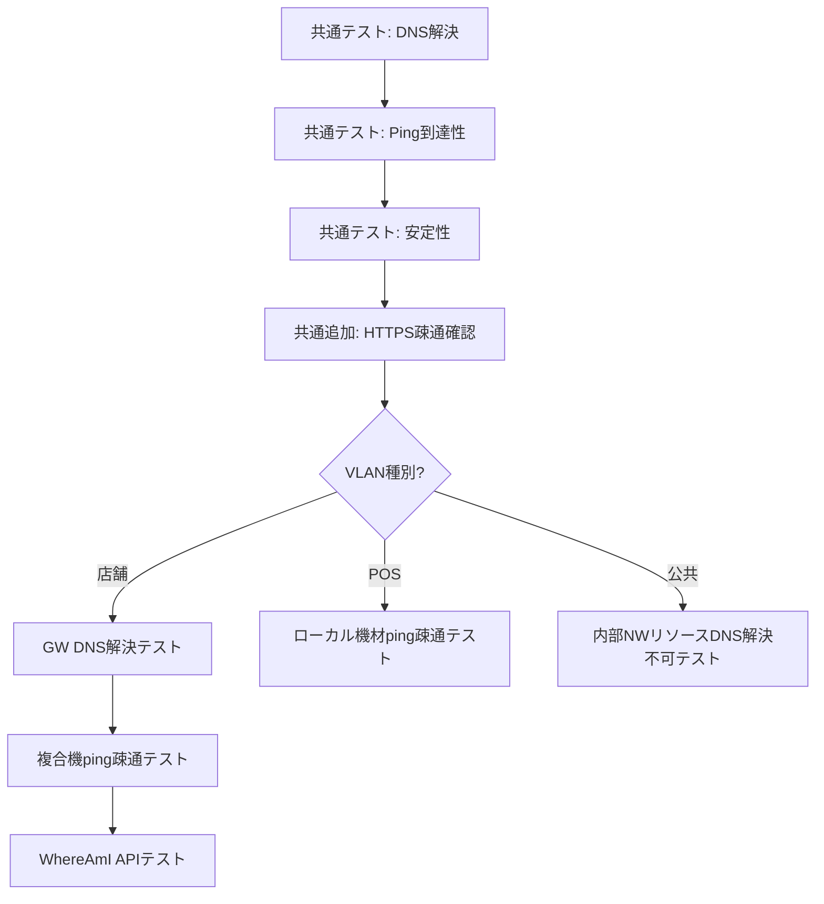
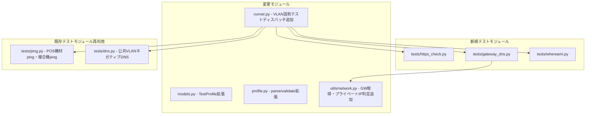
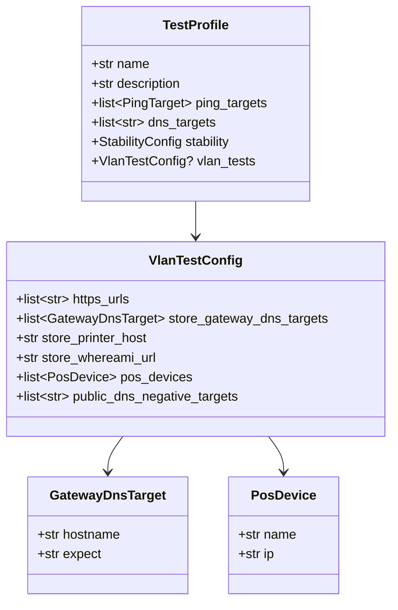

# 設計ドキュメント: VLAN種別固有テスト

## Overview

本設計は、店舗ネットワークテスト自動化ツールにVLAN種別ごとの固有テストを追加する拡張である。

現行の共通テスト（DNS解決、Ping到達性、安定性）に加え、以下のテストを追加する:

1. **HTTPS疎通確認テスト**（全VLAN共通）: 指定URLへのHTTPSリクエストでステータスコード200を確認
2. **店舗VLAN固有テスト**:
   - デフォルトゲートウェイDNS解決テスト: ゲートウェイIPをDNSサーバーとして使用し、内部ドメインの解決結果を検証
   - 複合機ping疎通テスト: 複合機ホスト名へのICMP ping
   - WhereAmI APIテスト: APIレスポンスのshopCodeとウィザード入力の店舗コードを照合
3. **POS VLAN固有テスト**: ローカル機材（券売機1〜3、DL）へのping疎通
4. **公共VLAN固有テスト**: 内部NWリソースのDNS解決不可確認（ネガティブテスト）

### 設計方針

- 既存テストモジュール（`dns.py`, `ping.py`, `stability.py`）のパターンに準拠
- 各テスト関数は `TestResult` または `list[TestResult]` を返す
- テスト対象ホスト・URL・IPアドレスは `TestProfile` で管理し、ハードコードしない
- `runner.py` の `_run_tests_for_wan_path` を拡張し、`vlan_type` パラメータに基づいてVLAN固有テストをディスパッチ

### テスト実行フロー



## Architecture

### 新規・変更モジュール



### ディレクトリ構成（変更箇所）

```
src/store_net_test/
├── models.py              # TestProfile拡張（VLAN固有設定フィールド追加）
├── profile.py             # parse_profile / validate_profile 拡張
├── runner.py              # _run_tests_for_wan_path 拡張
├── tests/
│   ├── dns.py             # 既存（公共VLANネガティブテストで再利用）
│   ├── ping.py            # 既存（POS機材ping・複合機pingで再利用）
│   ├── https_check.py     # 新規: HTTPS疎通確認テスト
│   ├── gateway_dns.py     # 新規: デフォルトゲートウェイDNS解決テスト
│   └── whereami.py        # 新規: WhereAmI APIテスト
└── utils/
    └── network.py         # get_default_gateway / is_private_ip 追加
profiles/
└── default.json           # VLAN固有テスト設定フィールド追加
```


## Components and Interfaces

### 1. HTTPS疎通確認テスト (`tests/https_check.py`)

全VLAN共通で実行される新規テストモジュール。

```python
def run_https_check(urls: list[str], wan_path: WANPath) -> list[TestResult]:
    """HTTPS疎通確認テストを実行する

    各URLにHTTPS GETリクエストを送信し、ステータスコード200の応答を確認する。

    Args:
        urls: テスト対象URLリスト（TestProfileから取得）
        wan_path: テスト対象のWAN経路

    Returns:
        各URLに対するTestResultのリスト
    """
    ...
```

**設計判断**: `httpx`（既存依存）を同期モードで使用。各URLに対して個別のTestResultを生成し、接続エラー・タイムアウト時はFAILとしてエラーメッセージを記録する。既存テストモジュール（`dns.py`, `ping.py`）と同じパターンに従う。

### 2. デフォルトゲートウェイDNS解決テスト (`tests/gateway_dns.py`)

店舗VLAN固有テスト。デフォルトゲートウェイIPをDNSサーバーとして使用し、内部ドメインの解決結果を検証する。

```python
@dataclass
class GatewayDnsTarget:
    """ゲートウェイDNSテスト対象"""
    hostname: str
    expect: str  # "private_ip" | "nxdomain" | "resolve_success"

def run_gateway_dns_test(
    targets: list[GatewayDnsTarget],
    wan_path: WANPath,
) -> list[TestResult]:
    """デフォルトゲートウェイDNS解決テストを実行する

    システムのデフォルトゲートウェイIPをDNSサーバーとして使用し、
    各ホスト名の解決結果を期待値と照合する。

    Args:
        targets: テスト対象ホスト名と期待結果のリスト（TestProfileから取得）
        wan_path: テスト対象のWAN経路

    Returns:
        各ホスト名に対するTestResultのリスト
    """
    ...
```

**設計判断**: `GatewayDnsTarget`データクラスでホスト名と期待結果をペアにし、TestProfileで管理する。期待結果は3種類:
- `"private_ip"`: 解決結果がRFC 1918プライベートIPであること
- `"nxdomain"`: 名前解決が失敗すること
- `"resolve_success"`: 名前解決が成功すること（IPの内容は問わない）

ゲートウェイIP取得失敗時は全テスト項目をFAILとする。

### 3. WhereAmI APIテスト (`tests/whereami.py`)

店舗VLAN固有テスト。WhereAmI APIのレスポンスJSONからshopCodeを取得し、ウィザード入力の店舗コードと照合する。

```python
def run_whereami_test(
    api_url: str,
    store_code: str,
    wan_path: WANPath,
) -> TestResult:
    """WhereAmI APIテストを実行する

    APIエンドポイントにGETリクエストを送信し、レスポンスJSONの
    shopCodeフィールドをstore_code（整数比較）と照合する。

    Args:
        api_url: WhereAmI APIエンドポイントURL（TestProfileから取得）
        store_code: ウィザード入力の店舗コード
        wan_path: テスト対象のWAN経路

    Returns:
        TestResult
    """
    ...
```

**設計判断**: `httpx`を同期モードで使用。shopCodeとstore_codeは整数として比較する（先頭ゼロの差異を吸収）。

### 4. ネットワークユーティリティ拡張 (`utils/network.py`)

```python
def get_default_gateway() -> str | None:
    """システムのデフォルトゲートウェイIPアドレスを取得する

    Windows: `ipconfig` コマンドの出力をパース
    macOS/Linux: `ip route` または `netstat -rn` の出力をパース

    Returns:
        デフォルトゲートウェイIPアドレス文字列。取得失敗時はNone
    """
    ...

def is_private_ip(ip_address: str) -> bool:
    """IPアドレスがRFC 1918プライベートIPアドレスかを判定する

    対象範囲:
    - 10.0.0.0/8
    - 172.16.0.0/12
    - 192.168.0.0/16

    Args:
        ip_address: 判定対象のIPアドレス文字列

    Returns:
        プライベートIPならTrue、それ以外はFalse
    """
    ...
```

**設計判断**: `is_private_ip`はPython標準ライブラリの`ipaddress.ip_address().is_private`を使用。`get_default_gateway`はOS固有コマンドの出力をパースする（`subprocess`使用）。

### 5. Runner拡張 (`runner.py`)

`_run_tests_for_wan_path`にVLAN固有テストのディスパッチロジックを追加する。

```python
def _run_tests_for_wan_path(
    profile: TestProfile,
    wan_path: WANPath,
    wizard_input: WizardInput,
    vlan_type: str,
) -> SuiteResult:
    """指定WAN経路でテストスイートを実行する

    実行順序:
    1. DNS解決テスト（共通）
    2. Ping到達性テスト（共通）
    3. 安定性テスト（共通）
    4. HTTPS疎通確認テスト（全VLAN共通追加）
    5. VLAN種別固有テスト（vlan_typeに応じてディスパッチ）
    """
    ...
```

VLAN種別ごとのディスパッチ:
- `"店舗"`: `run_gateway_dns_test` → `run_ping_test`（複合機） → `run_whereami_test`
- `"POS"`: `run_ping_test`（ローカル機材）
- `"公共"`: `run_dns_test`（ネガティブテスト） + 結果のpass/fail反転

**設計判断**: 公共VLANのネガティブDNSテストは、既存の`run_dns_test`を呼び出し、結果のpass/failを反転させるラッパー関数を`runner.py`内に実装する。これにより`dns.py`モジュール自体は変更不要。

### 6. TestProfile拡張 (`models.py`)

```python
@dataclass
class GatewayDnsTarget:
    """ゲートウェイDNSテスト対象"""
    hostname: str
    expect: str  # "private_ip" | "nxdomain" | "resolve_success"

@dataclass
class PosDevice:
    """POS VLANローカル機材"""
    name: str
    ip: str

@dataclass
class VlanTestConfig:
    """VLAN種別固有テスト設定"""
    https_urls: list[str]
    store_gateway_dns_targets: list[GatewayDnsTarget]
    store_printer_host: str
    store_whereami_url: str
    pos_devices: list[PosDevice]
    public_dns_negative_targets: list[str]

@dataclass
class TestProfile:
    """テストプロファイル定義（拡張）"""
    name: str
    description: str
    ping_targets: list[PingTarget]
    dns_targets: list[str]
    stability: StabilityConfig
    vlan_tests: VlanTestConfig | None = None  # 後方互換性のためOptional
```

**設計判断**: `VlanTestConfig`を単一のデータクラスにまとめ、`TestProfile`に`vlan_tests`フィールドとして追加する。`None`デフォルトにより既存プロファイルとの後方互換性を維持する。


## Data Models

### TestProfile JSON スキーマ（拡張後）

```json
{
  "name": "standard",
  "description": "標準店舗テストプロファイル",
  "ping_targets": [
    { "host": "8.8.8.8", "timeout_ms": 1000 },
    { "host": "1.1.1.1", "timeout_ms": 1000 }
  ],
  "dns_targets": [
    "www.google.com",
    "dns.google"
  ],
  "stability": {
    "target_host": "8.8.8.8",
    "duration_seconds": 30,
    "max_packet_loss_percent": 5.0,
    "max_jitter_ms": 50.0
  },
  "vlan_tests": {
    "https_urls": [
      "https://www.google.com",
      "https://www.cloudflare.com",
      "https://www.amazon.co.jp"
    ],
    "store_gateway_dns_targets": [
      { "hostname": "api.yamaokaya.net", "expect": "private_ip" },
      { "hostname": "nx.yamaokaya.net", "expect": "private_ip" },
      { "hostname": "pornhub.com", "expect": "nxdomain" },
      { "hostname": "yamaokaya.lightning.force.com", "expect": "resolve_success" }
    ],
    "store_printer_host": "prn.myshop.yamaokaya.net",
    "store_whereami_url": "https://api.yamaokaya.net/wb/whereami",
    "pos_devices": [
      { "name": "券売機1", "ip": "192.168.1.81" },
      { "name": "券売機2", "ip": "192.168.1.82" },
      { "name": "券売機3", "ip": "192.168.1.83" },
      { "name": "DL", "ip": "192.168.1.110" }
    ],
    "public_dns_negative_targets": [
      "nx.yamaokaya.net"
    ]
  }
}
```

### 新規データクラス関係図



### HTTPS疎通確認テスト結果例

```json
{
  "test_name": "https_www.google.com",
  "wan_path": "ftth",
  "status": "pass",
  "timestamp": "2024-01-15T10:30:05+00:00",
  "details": {
    "url": "https://www.google.com",
    "status_code": 200,
    "response_time_ms": 150.5
  },
  "error_message": null
}
```

### ゲートウェイDNS解決テスト結果例

```json
{
  "test_name": "gw_dns_api.yamaokaya.net",
  "wan_path": "ftth",
  "status": "pass",
  "timestamp": "2024-01-15T10:30:06+00:00",
  "details": {
    "gateway_ip": "192.168.1.1",
    "hostname": "api.yamaokaya.net",
    "expect": "private_ip",
    "resolved_ips": ["10.0.1.50"],
    "is_private": true
  },
  "error_message": null
}
```

### WhereAmI APIテスト結果例

```json
{
  "test_name": "whereami_api",
  "wan_path": "ftth",
  "status": "pass",
  "timestamp": "2024-01-15T10:30:07+00:00",
  "details": {
    "api_url": "https://api.yamaokaya.net/wb/whereami",
    "expected_store_code": "0001",
    "actual_shop_code": 1,
    "match": true
  },
  "error_message": null
}
```


## Correctness Properties

*プロパティとは、システムの全ての有効な実行において真であるべき特性や振る舞いのことである。人間が読める仕様と機械的に検証可能な正しさの保証を橋渡しする、形式的な記述である。*

### Property 1: HTTPS疎通確認テストのステータスコード判定

*For any* URLとHTTPレスポンスの組み合わせに対して、ステータスコードが200の場合はPASS、200以外の場合はFAILと判定されなければならない。また、接続エラー・タイムアウト発生時はFAILと判定され、error_messageが非Noneでなければならない。

**Validates: Requirements 1.3, 1.4**

### Property 2: ゲートウェイDNS解決テストの期待値判定

*For any* GatewayDnsTargetと名前解決結果の組み合わせに対して:
- expectが`"private_ip"`の場合、解決結果がRFC 1918プライベートIPならPASS、それ以外ならFAIL
- expectが`"nxdomain"`の場合、名前解決が失敗すればPASS、成功すればFAIL
- expectが`"resolve_success"`の場合、名前解決が成功すればPASS、失敗すればFAIL

**Validates: Requirements 2.4, 2.5, 2.6, 2.7**

### Property 3: WhereAmI shopCode照合の正確性

*For any* shopCode（整数）とstore_code（文字列）の組み合わせに対して、shopCodeの整数値とstore_codeの整数値が等しい場合はPASS、異なる場合はFAILと判定されなければならない。

**Validates: Requirements 4.3, 4.4, 4.5**

### Property 4: プライベートIPアドレス判定の正確性

*For any* 有効なIPv4アドレス文字列に対して、`is_private_ip`関数はそのアドレスがRFC 1918プライベートIPアドレス範囲（10.0.0.0/8、172.16.0.0/12、192.168.0.0/16）に含まれる場合にTrue、含まれない場合にFalseを返さなければならない。

**Validates: Requirements 10.1, 10.2, 10.3**

### Property 5: 拡張TestProfileのラウンドトリップ

*For any* 有効なTestProfile（vlan_testsフィールドを含む）に対して、`profile_to_dict`で辞書に変換し、`parse_profile`でTestProfileに戻した結果は、元のTestProfileと等価でなければならない。

**Validates: Requirements 7.1, 7.2, 7.3, 7.4, 7.5, 7.6**

### Property 6: ネガティブDNSテストのpass/fail反転

*For any* ホスト名とDNS解決結果に対して、ネガティブDNSテストでは名前解決が失敗した場合にPASS、成功した場合にFAILと判定されなければならない。これは通常のDNSテスト（成功=PASS、失敗=FAIL）の逆である。

**Validates: Requirements 6.3, 6.4**

### Property 7: HTTPS疎通確認テストの結果数

*For any* URLリスト（長さN）に対して、`run_https_check`が返すTestResultのリスト長はNと等しくなければならない。

**Validates: Requirements 1.6**


## Error Handling

### エラーカテゴリと対応方針

| カテゴリ | 発生箇所 | 対応 |
|---------|---------|------|
| HTTPS接続エラー/タイムアウト | `https_check.py` | FAILと判定、error_messageに詳細記録 |
| デフォルトゲートウェイ取得失敗 | `utils/network.py` | Noneを返す → `gateway_dns.py`で全テスト項目をFAIL |
| ゲートウェイDNS解決エラー | `gateway_dns.py` | 当該ホスト名のテストをFAIL、error_messageに詳細記録 |
| WhereAmI API接続エラー/タイムアウト | `whereami.py` | FAILと判定、error_messageに詳細記録 |
| WhereAmI APIレスポンスJSON不正 | `whereami.py` | FAILと判定、error_messageにパースエラー詳細記録 |
| POS機材ping失敗 | `ping.py`（既存） | FAILと判定（既存パターン） |
| 公共VLANネガティブDNS解決成功 | `runner.py` | FAILと判定（解決できてしまった = 遮断されていない） |
| VLAN固有テスト個別エラー | `runner.py` | エラーログ記録 + スキップ + 次のテスト継続（既存パターン） |
| プロファイルにvlan_testsフィールドなし | `runner.py` | VLAN固有テストをスキップ（後方互換性） |
| 不正なIPアドレス文字列 | `utils/network.py` | `is_private_ip`でFalseを返す |

### エラーメッセージの方針

既存パターンに準拠:
- 全てのエラーメッセージは日本語で表示
- 技術的な詳細（例外メッセージ等）は英語のまま付記
- `rich`ライブラリを使用して、エラーは赤色で表示
- 例: `⚠ HTTPS疎通確認テストでエラー: Connection timed out`
- 例: `⚠ デフォルトゲートウェイの取得に失敗しました`

## Testing Strategy

### テストフレームワーク

- **ユニットテスト**: `pytest`（既存）
- **プロパティベーステスト**: `hypothesis`（既存依存）
- **モック**: `pytest-mock` + `unittest.mock`（既存）
- **HTTPモック**: `unittest.mock.patch` で `httpx` をモック

### テスト構成

#### ユニットテスト（具体例・エッジケース・エラー条件）

| テスト対象 | テスト内容 |
|-----------|-----------|
| `https_check.py` | 接続エラー時のFAIL判定とerror_message記録（Req 1.5） |
| `gateway_dns.py` | ゲートウェイ取得失敗時の全テスト項目FAIL（Req 2.8） |
| `whereami.py` | 接続エラー時のFAIL判定とerror_message記録（Req 4.6） |
| `whereami.py` | レスポンスJSON不正時のFAIL判定（Req 4.6） |
| `runner.py` | 店舗VLANで固有テスト3種が実行されること（Req 8.2） |
| `runner.py` | POS VLANでローカル機材pingが実行されること（Req 8.3） |
| `runner.py` | 公共VLANでネガティブDNSが実行されること（Req 8.4） |
| `runner.py` | vlan_testsがNoneの場合にVLAN固有テストがスキップされること |
| `utils/network.py` | ゲートウェイ取得失敗時にNoneを返すこと（Req 9.3） |
| `profile.py` | vlan_testsフィールドを含むプロファイルの読み込み（Req 7.7） |
| `profile.py` | vlan_testsフィールドなしの既存プロファイルとの後方互換性 |
| `profiles/default.json` | デフォルトプロファイルにvlan_testsが含まれること（Req 7.7） |

#### プロパティベーステスト（全入力に対する普遍的性質）

各プロパティテストは最低100イテレーション実行する。各テストにはコメントで設計ドキュメントのプロパティ番号を参照する。

| Property | テストファイル | タグ |
|----------|-------------|------|
| Property 1 | tests/test_https_check.py | Feature: vlan-specific-tests, Property 1: HTTPS疎通確認テストのステータスコード判定 |
| Property 2 | tests/test_gateway_dns.py | Feature: vlan-specific-tests, Property 2: ゲートウェイDNS解決テストの期待値判定 |
| Property 3 | tests/test_whereami.py | Feature: vlan-specific-tests, Property 3: WhereAmI shopCode照合の正確性 |
| Property 4 | tests/test_network.py | Feature: vlan-specific-tests, Property 4: プライベートIPアドレス判定の正確性 |
| Property 5 | tests/test_profile.py | Feature: vlan-specific-tests, Property 5: 拡張TestProfileのラウンドトリップ |
| Property 6 | tests/test_runner.py | Feature: vlan-specific-tests, Property 6: ネガティブDNSテストのpass/fail反転 |
| Property 7 | tests/test_https_check.py | Feature: vlan-specific-tests, Property 7: HTTPS疎通確認テストの結果数 |

#### Hypothesisストラテジー例

```python
from hypothesis import given, settings, strategies as st

# Property 1: HTTPSステータスコード判定
# Feature: vlan-specific-tests, Property 1: HTTPS疎通確認テストのステータスコード判定
@given(status_code=st.integers(min_value=100, max_value=599))
@settings(max_examples=100)
def test_https_status_code_判定(status_code: int):
    """ステータスコード200ならPASS、それ以外ならFAIL"""
    result = evaluate_https_status(status_code)
    if status_code == 200:
        assert result == TestStatus.PASS
    else:
        assert result == TestStatus.FAIL

# Property 4: プライベートIP判定
# Feature: vlan-specific-tests, Property 4: プライベートIPアドレス判定の正確性
@given(
    octets=st.tuples(
        st.integers(min_value=0, max_value=255),
        st.integers(min_value=0, max_value=255),
        st.integers(min_value=0, max_value=255),
        st.integers(min_value=0, max_value=255),
    )
)
@settings(max_examples=100)
def test_is_private_ip_正確性(octets: tuple[int, int, int, int]):
    """RFC 1918範囲内ならTrue、範囲外ならFalse"""
    a, b, c, d = octets
    ip_str = f"{a}.{b}.{c}.{d}"
    result = is_private_ip(ip_str)
    expected = (
        a == 10
        or (a == 172 and 16 <= b <= 31)
        or (a == 192 and b == 168)
    )
    assert result == expected

# Property 5: 拡張TestProfileラウンドトリップ
# Feature: vlan-specific-tests, Property 5: 拡張TestProfileのラウンドトリップ
gateway_dns_target_strategy = st.builds(
    GatewayDnsTarget,
    hostname=st.from_regex(r"[a-z][a-z0-9\-\.]{1,30}", fullmatch=True),
    expect=st.sampled_from(["private_ip", "nxdomain", "resolve_success"]),
)

pos_device_strategy = st.builds(
    PosDevice,
    name=st.text(min_size=1, max_size=20),
    ip=st.from_regex(r"\d{1,3}\.\d{1,3}\.\d{1,3}\.\d{1,3}", fullmatch=True),
)

vlan_test_config_strategy = st.builds(
    VlanTestConfig,
    https_urls=st.lists(st.from_regex(r"https://[a-z][a-z0-9\.\-]{1,30}", fullmatch=True), min_size=1, max_size=5),
    store_gateway_dns_targets=st.lists(gateway_dns_target_strategy, min_size=1, max_size=5),
    store_printer_host=st.from_regex(r"[a-z][a-z0-9\.\-]{1,30}", fullmatch=True),
    store_whereami_url=st.from_regex(r"https://[a-z][a-z0-9\.\-/]{1,50}", fullmatch=True),
    pos_devices=st.lists(pos_device_strategy, min_size=1, max_size=5),
    public_dns_negative_targets=st.lists(st.from_regex(r"[a-z][a-z0-9\.\-]{1,30}", fullmatch=True), min_size=1, max_size=5),
)

@given(profile=test_profile_with_vlan_strategy)
@settings(max_examples=100)
def test_拡張プロファイルラウンドトリップ(profile: TestProfile):
    result = parse_profile(profile_to_dict(profile))
    assert result == profile
```

### テスト実行方法

```bash
# 全テスト実行
uv run pytest tests/ -v

# VLAN固有テスト関連のみ
uv run pytest tests/test_https_check.py tests/test_gateway_dns.py tests/test_whereami.py tests/test_network.py -v

# プロパティベーステストのみ
uv run pytest tests/ -v -k "property"
```

