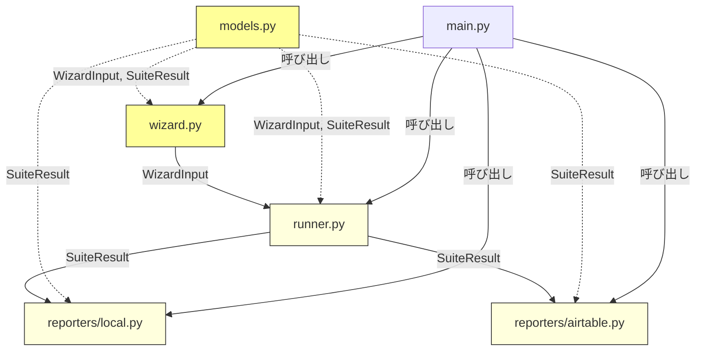
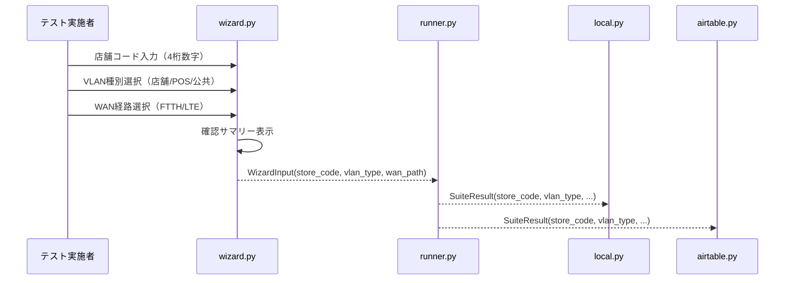

# Design Document: wizard-input-refactor

## Overview

店舗ネットワークテスト自動化ツールの Setup Wizard リファクタリング設計。
現行の5ステップ対話入力（店舗名 → NW領域 → VLAN → WAN経路 → テストプロファイル）を、
3ステップ（店舗コード → VLAN種別 → WAN経路）に再構成する。

### 変更の要約

| 項目 | 現行 | 変更後 |
|------|------|--------|
| ステップ1 | 店舗名（自由テキスト） | 店舗コード（4桁数字 `[0-9]{4}`） |
| ステップ2 | NW領域（選択） | VLAN種別（店舗/POS/公共 選択） |
| ステップ3 | VLAN（自由テキスト） | WAN経路（FTTH/LTE 2択） |
| ステップ4 | WAN経路（FTTH/LTE/両方） | _(削除)_ |
| ステップ5 | テストプロファイル（選択） | _(削除)_ |

### 設計方針

- 「小さく始めて、賢く構築する」に従い、既存アーキテクチャを維持しつつフィールド名・バリデーションのみ変更
- 破壊的変更を一括で行い、中間的な互換レイヤーは設けない（内部ツールのため）
- 全モジュールの整合性を同時に更新する

## Architecture

### 影響範囲

変更は以下のモジュールに波及する。アーキテクチャ構造自体は変更しない。



黄色: 主要変更対象、薄黄色: フィールド名追従のみ

### データフロー（変更後）



## Components and Interfaces

### 1. wizard.py — 変更内容

#### 削除する要素
- `DEFAULT_NW_AREAS` 定数
- `WAN_PATH_CHOICES` 定数
- `validate_store_name()` 関数
- `validate_vlan()` 関数
- `_parse_wan_selection()` 関数
- `ProfileSummary` dataclass
- ステップ2（NW領域選択）のコード
- ステップ3（VLAN自由テキスト入力）のコード
- ステップ5（テストプロファイル選択）のコード

#### 追加する要素
- `VLAN_TYPE_CHOICES` 定数: `["店舗", "POS", "公共"]`
- `WAN_PATH_CHOICES` 定数（再定義）: `[{"name": "FTTH", "value": "ftth"}, {"name": "LTE", "value": "lte"}]`
- `validate_store_code(code: str) -> str | None` 関数

#### 変更する要素
- `run_wizard()`: 3ステップ構成に変更、`nw_areas` パラメータ削除、`available_profiles` パラメータ削除
- `_build_confirmation_text()`: `store_code`、`vlan_type`、`wan_path`（単一値）を使用、`nw_area` 行を削除、`test_profile` 行を削除
- `display_confirmation()`: 同上

#### validate_store_code のインターフェース

```python
def validate_store_code(code: str) -> str | None:
    """店舗コードバリデーション

    入力を strip() した後、正規表現 ^[0-9]{4}$ に一致するか検証する。

    Args:
        code: 入力された店舗コード

    Returns:
        エラーメッセージ（バリデーション失敗時）またはNone（成功時）
    """
```

### 2. models.py — 変更内容

#### WizardInput

```python
@dataclass
class WizardInput:
    """Setup Wizardの入力結果"""
    store_code: str      # 旧: store_name
    vlan_type: str       # 旧: vlan（値は「店舗」「POS」「公共」）
    wan_path: WANPath    # 旧: wan_paths: list[WANPath]（単一値に変更）
    test_profile: str    # 変更なし
    # nw_area: 削除
```

#### SuiteResult

```python
@dataclass
class SuiteResult:
    """テストスイート全体の結果"""
    store_code: str      # 旧: store_name
    vlan_type: str       # 旧: vlan
    wan_path: WANPath         # 変更なし
    profile_name: str         # 変更なし
    results: list[TestResult] # 変更なし
    execution_timestamp: datetime  # 変更なし
    # nw_area: 削除
```

### 3. runner.py — 変更内容

`_run_tests_for_wan_path()` 内の `SuiteResult` 構築を更新:
- `store_name=wizard_input.store_name` → `store_code=wizard_input.store_code`
- `nw_area=wizard_input.nw_area` → 削除
- `vlan=wizard_input.vlan` → `vlan_type=wizard_input.vlan_type`

`run_test_suite()` を更新:
- `wizard_input.wan_paths`（リスト）のループ → `wizard_input.wan_path`（単一値）で1回実行
- 戻り値を `list[SuiteResult]` から `SuiteResult` に変更

`display_summary()` 内の表示も同様に更新。

### 4. reporters/local.py — 変更内容

`suite_result_to_dict()`:
- `"store_name"` → `"store_code"`
- `"nw_area"` → 削除
- `"vlan"` → `"vlan_type"`

`save_results_to_json()`:
- ファイル名の `store_name` → `store_code`

### 5. reporters/airtable.py — 変更内容

`build_airtable_record()`:
- `"store_name"` → `"store_code"`
- `"nw_area"` → 削除
- `"vlan"` → `"vlan_type"`

`_submit_with_retry()` のログメッセージ:
- `suite_result.store_name` → `suite_result.store_code`

### 6. main.py — 変更内容

`_run()` を更新:
- `run_wizard()` の呼び出しから `available_profiles` パラメータを削除
- テストプロファイルは `profiles[0]`（最初に読み込まれたプロファイル）を自動使用
- `run_test_suite()` の戻り値が `SuiteResult`（単一）に変更されるため、後続処理を調整
- `display_summary()` と `submit_results()` の引数をリストから単一値に調整

### 7. テストコード — 変更内容

`tests/test_reporter.py`:
- `_make_suite_result()` ヘルパーのフィールド名を更新
- 全アサーションのキー名を更新

## Data Models

### VlanType（新規列挙型は導入しない）

要件では `vlan_type` の値は「店舗」「POS」「公共」の3種だが、
`WizardInput.vlan_type` は `str` 型のまま保持する。
理由: questionary.select の戻り値が文字列であり、Enum変換の追加コストに見合うメリットがない。
バリデーションは選択肢の制約で担保される。

### フィールドマッピング（旧 → 新）

| モデル | 旧フィールド | 新フィールド | 型 |
|--------|-------------|-------------|-----|
| WizardInput | `store_name: str` | `store_code: str` | `str` |
| WizardInput | `nw_area: str` | _(削除)_ | - |
| WizardInput | `vlan: str` | `vlan_type: str` | `str` |
| WizardInput | `wan_paths: list[WANPath]` | `wan_path: WANPath` | `WANPath` |
| SuiteResult | `store_name: str` | `store_code: str` | `str` |
| SuiteResult | `nw_area: str` | _(削除)_ | - |
| SuiteResult | `vlan: str` | `vlan_type: str` | `str` |

### JSON出力スキーマ（変更後）

```json
{
  "store_code": "0001",
  "vlan_type": "店舗",
  "wan_path": "ftth",
  "profile_name": "standard",
  "execution_timestamp": "2024-01-15T10:30:00+00:00",
  "overall_status": "pass",
  "results": [...]
}
```

### Airtableレコードスキーマ（変更後）

```json
{
  "store_code": "0001",
  "vlan_type": "店舗",
  "wan_path": "FTTH",
  "execution_time": "2024-01-15T10:30:00+00:00",
  "profile": "standard",
  "overall_status": "pass",
  "results_json": "[...]",
  "passed_count": 3,
  "failed_count": 0,
  "warning_count": 0
}
```

## Correctness Properties

*A property is a characteristic or behavior that should hold true across all valid executions of a system—essentially, a formal statement about what the system should do. Properties serve as the bridge between human-readable specifications and machine-verifiable correctness guarantees.*

### Property 1: validate_store_code は正規表現 `^[0-9]{4}$` と等価

*For any* 文字列 `s` に対して、`validate_store_code(s.strip())` が `None` を返す ⟺ `s.strip()` が正規表現 `^[0-9]{4}$` に一致する。つまり、4桁数字のみ受理し、それ以外はすべてエラーメッセージを返す。

**Validates: Requirements 1.2, 1.3, 1.4, 11.1, 11.2**

### Property 2: Local Reporter の辞書キー整合性

*For any* 有効な `SuiteResult` に対して、`suite_result_to_dict` の出力辞書は `store_code` キーと `vlan_type` キーを含み、`store_name` キー、`nw_area` キー、`vlan` キーを含まない。

**Validates: Requirements 8.1, 8.2, 8.3**

### Property 3: Local Reporter のファイル名に store_code を含む

*For any* 有効な `SuiteResult` に対して、`save_results_to_json` が生成するファイル名には `store_code` の値が含まれる。

**Validates: Requirements 8.4**

### Property 4: Airtable Reporter のレコードキー整合性

*For any* 有効な `SuiteResult` に対して、`build_airtable_record` の出力辞書は `store_code` キーと `vlan_type` キーを含み、`store_name` キー、`nw_area` キー、`vlan` キーを含まない。

**Validates: Requirements 9.1, 9.2, 9.3**

### Property 5: 確認サマリーのフィールド整合性

*For any* 有効な `WizardInput` に対して、`_build_confirmation_text` の出力文字列は「店舗コード」ラベルと `store_code` の値、「VLAN種別」ラベルと `vlan_type` の値を含み、「NW領域」という文字列を含まない。

**Validates: Requirements 10.1, 10.2, 10.3**

## Error Handling

### 店舗コード入力のバリデーションエラー

- 4桁数字以外の入力 → `validate_store_code` がエラーメッセージ「店舗コードは4桁の数字で入力してください（例: 0001）」を返す
- questionary の `validate` パラメータにより、エラー時は再入力を自動的に求める
- 空文字列も同じエラーメッセージで処理される

### ウィザード中断

- 各ステップで `Ctrl+C` による中断時は `KeyboardInterrupt` を送出（既存動作を維持）
- `questionary` が `None` を返した場合も同様に `KeyboardInterrupt` を送出

### データモデルの型安全性

- `WizardInput` と `SuiteResult` は dataclass のため、フィールド名の不一致はインスタンス化時に `TypeError` となる
- 旧フィールド名（`store_name`, `nw_area`, `vlan`）でのインスタンス化は即座にエラーとなり、見落としを防止

## Testing Strategy

### テストフレームワーク

- ユニットテスト: `pytest` (既存)
- プロパティベーステスト: `hypothesis` (既存の dev-dependency)
- 各プロパティテストは最低100イテレーション実行（Hypothesis のデフォルト設定で担保）

### プロパティベーステスト

各 Correctness Property に対して1つのプロパティベーステストを実装する。

| Property | テスト対象関数 | 生成戦略 |
|----------|--------------|---------|
| Property 1 | `validate_store_code` | `hypothesis.strategies.text()` で任意文字列を生成 |
| Property 2 | `suite_result_to_dict` | `SuiteResult` のフィールドをランダム生成 |
| Property 3 | `save_results_to_json` | `SuiteResult` のフィールドをランダム生成 |
| Property 4 | `build_airtable_record` | `SuiteResult` のフィールドをランダム生成 |
| Property 5 | `_build_confirmation_text` | `WizardInput` のフィールドをランダム生成 |

各テストには以下のタグコメントを付与する:
```python
# Feature: wizard-input-refactor, Property {number}: {property_text}
```

### ユニットテスト

プロパティテストで網羅できない具体的なケースをユニットテストで補完する:

- ウィザードの3ステップ構成確認（questionary のモック使用）
- `DEFAULT_NW_AREAS` 定数の削除確認
- `validate_store_name`、`validate_vlan` 関数の削除確認
- `WizardInput`、`SuiteResult` のフィールド構造確認
- 確認サマリーの具体的な出力文字列確認
- 既存テスト（`test_reporter.py`、`test_profile.py`）のフィールド名更新後の動作確認

### テストファイル構成

```
tests/
├── test_reporter.py          # 既存テストのフィールド名更新
├── test_profile.py           # 変更なし
├── test_wizard_validation.py # 新規: validate_store_code のプロパティテスト + ユニットテスト
└── test_models.py            # 新規: データモデル構造確認 + レポーターのプロパティテスト
```
